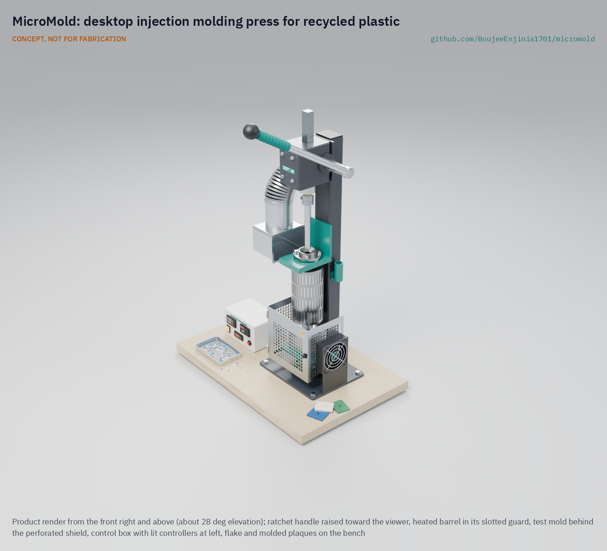

# MicroMold

     

**Area:** Advanced Manufacturing · **TRL:** 3 of 9 (proof of concept on paper) · **Value-engineering target:** USD 520 (estimated cost USD 544) · **Difficulty:** 3 of 5

A desktop injection molding press for recycled plastic: a lever or screw press with a heated barrel and interchangeable aluminum molds, turning shredded waste plastic into small useful parts.

[Exploded render](media/render-exploded.png) · [Interactive 3D model](media/viewer.html) · [Concept blueprint (PDF)](media/concept-blueprint.pdf) · [General arrangement (PDF)](cad/drawings/MMD-DWG-001.pdf) · [Sizing calculations](docs/04-calcs/01-sizing.md) · [Prototype build plan](docs/05-build-plan.md) · [Design decisions](docs/06-design-decisions.md) · [Review note](docs/REVIEW.md)

## Concept rationale

Molding turns sorted flake into finished parts, which sell for far more than flake sold by weight, and it lets a community make the small parts it would otherwise import. MicroMold uses the simplest injection process that still gives useful pressure: a heated barrel, a hand-driven plunger and a bolted aluminum mold. The drive is the rack and pinion of a 1 t arbor press on a taller column, turned by a ratchet handle, which gives a long stroke and 22.5:1 advantage from one bought tool (the brief allows a lever or screw drive; Amish chose this one on 2026-09-25).

It is open and garage-buildable because the value is in local making. Only the barrel and the molds need a lathe or mill, which most towns have in a machine shop, and a new mold costs tens of dollars in aluminum and machining rather than thousands for steel tooling. Open drawings let groups repair the press, share molds and adapt it, as the Precious Plastic community has done for its own machines.

## Burning platform

Only 9 % of the world's plastic waste is successfully recycled, while most is landfilled, incinerated or leaks into the environment ([OECD, 2022](https://www.oecd.org/en/about/news/press-releases/2022/02/plastic-pollution-is-growing-relentlessly-as-waste-management-and-recycling-fall-short.html); [*Global Plastics Outlook*](https://www.oecd.org/en/publications/global-plastics-outlook_de747aef-en.html)). Municipal solid waste reached 2.56 billion tonnes in 2022 and is projected to reach 3.86 billion tonnes by 2050, while collection covers only 31 % of waste in sub-Saharan Africa and 67 % in South Asia ([World Bank, *What a Waste 3.0*](https://www.worldbank.org/en/publication/what-a-waste)).

Recycling groups need products that pay for collection, and exporting scrap is getting harder: since 1 January 2021 the Basel Convention plastic waste amendments have required prior informed consent for most mixed or contaminated plastic waste shipments ([Basel Convention](https://www.basel.int/implementation/plasticwaste/amendments/overview/tabid/8426/default.aspx)). Adding value locally, by molding parts, is one of the few routes left for small operators.

## Where it could be used

### By industry

| Industry | Use |
| --- | --- |
| Community recycling and social enterprise | Turn sorted HDPE and PP flake into hooks, clips, knobs and tiles for local sale |
| Education and vocational training | Teach polymer processing, mold design and the circular economy with a press students can take apart |
| Repair and maintenance | Short runs of discontinued knobs, spacers, bushings and clips |
| Product design and prototyping | Low-cost aluminum bridge tooling to test a part in real thermoplastic before paying for steel molds |
| Agriculture and construction | Non-structural items such as cable clips, tile spacers, plant labels and hose guides (not food contact) |

### By country or region

| Country or region | Why it matters there |
| --- | --- |
| Kenya | Single-use plastic carrier and flat bags have been banned since 2017 ([NEMA](https://www.nema.go.ke/index.php?option=com_content&view=article&id=241)); durable recycled products are a natural outlet for collected HDPE and PP |
| Sub-Saharan Africa | Collection covers only 31 % of waste ([World Bank](https://www.worldbank.org/en/publication/what-a-waste)); products that pay for collection make it viable |
| South Asia (India, Bangladesh) | Collection reaches 67 % ([World Bank](https://www.worldbank.org/en/publication/what-a-waste)); as collection grows, sorted flake needs local outlets that add value |
| Brazil | The National Solid Waste Policy (Law 12,305 of 2010) directs public cleaning services to prioritize cooperatives of low-income waste pickers and allows federal support for their equipment ([Planalto, Lei 12.305/2010](https://www.planalto.gov.br/ccivil_03/_ato2007-2010/2010/lei/l12305.htm), arts. 36 and 42); a press is the kind of equipment that lets a cooperative sell parts rather than flake |
| United States | Plastics recycling was 8.7 % in 2018 ([US EPA](https://www.epa.gov/facts-and-figures-about-materials-waste-and-recycling/plastics-material-specific-data)); makerspaces and schools can use it for local recycling programs |
| Europe (Netherlands and wider EU) | Precious Plastic workspaces already run open lever presses ([Precious Plastic Academy](https://onearmy.github.io/academy/build/injection)); a bench press with higher pressure widens what they can mold |

## What sparked the idea

The starting point was the machine widely credited as the first injection molder. In 1872 the brothers John Wesley and Isaiah Smith Hyatt of Albany, New York, patented an apparatus in which a plunger pressed celluloid stock through a heated cylinder and out of a discharge nozzle, with a two-part mold held shut by a clamp to receive it ([US Patent 133,229, 1872](https://patents.google.com/patent/US133229A/en)). Every part of MicroMold is already in that patent: a plunger, a heated vertical barrel, a nozzle and a clamped split mold. Industry later moved to reciprocating screws and machines of many tonnes, but the plunger layout remains the simplest way to mold small parts, and it asks for no motor, gearbox or screw. The gap between that 150-year-old principle and the open lever press of Precious Plastic, which reaches about 45 bar from a floor-standing frame ([Precious Plastic Academy](https://onearmy.github.io/academy/build/injection)), is the space MicroMold aims at: a bench press with about twice the pressure for recycled flake.

## Problem

Community recycling produces shredded plastic with few local uses, and small-batch molding of parts is out of reach without an injection press. Only about 9 % of plastic waste is recycled worldwide, and groups that do collect and shred plastic often sell flake by weight for little return. Design with, not for: requirements must come from co-design sessions with recycling groups through a local partner.

## Concept

A bench-top, hand-operated plunger injection press. The rack-and-pinion head of a 1 t arbor press, on a taller steel column and turned by a ratchet handle, drives a 22 mm plunger down a vertical barrel heated by two 300 W band heaters and a 100 W nozzle heater, each zone under PID control. Melt fills a bolted two-plate aluminum mold held against a 4 mm nozzle by a screw lift table inside a perforated shield, where a small fan cools the mold; a load cell under the ram shows the injection force, and a side hood with a duct fan draws fumes from the funnel. The TRL 3 calculations give up to 34 g of HDPE per shot at 8.9 MPa (89 bar) with 250 N on the handle in about four ratchet pulls, a 12.3 min warm-up, about 11 parts per hour and 753 W from a single-phase socket. Value-engineering target: USD 520. Estimated cost of the constructable design: USD 544 for the press (USD 24 over the target) and USD 638 with one mold; the press weighs about 39.0 kg against its 40 kg target (see the [sizing calculations](docs/04-calcs/01-sizing.md) and the [review note](docs/REVIEW.md)).

Full design precis: [docs/02-concept.md](docs/02-concept.md)

## Key components

- Heated steel barrel (22 mm bore) with two 300 W band heaters, and a 4 mm nozzle with a 100 W heater
- Rack-and-pinion drive head from a 1 t arbor press on a steel column, with a 450 mm ratchet handle
- 22 mm plunger with a load cell, on a glass-epoxy thermal spacer, for force and pressure indication
- Two-plate aluminum mold set on a lift table raised by a handwheel nut on a Tr20 screw
- Insulation jacket and perforated guard; perforated nozzle zone shield
- Side fume hood with a 100 mm inline duct fan
- 120 mm mold cooling fan on the base plate
- Control box with two PID controllers, SSRs, fused inlet and independent thermal cut-out

The priced bill of materials is in [bom/bom.csv](bom/bom.csv); the parametric model is [cad/src/model.py](cad/src/model.py), with STEP and STL exports in `cad/step/` and `cad/stl/`.

## Building the prototype

The [prototype build plan](docs/05-build-plan.md) (MMD-BLD-001) shows, in pictures, how to make each of the seventeen components and put them together in fourteen steps; nothing has been built yet. The frame is a steel column welded to a base plate with a shelf and a head plate, the barrel, nozzle and mold come from a local machine shop, the arbor press head is cut from its frame and bolted on, and the shield, fan bracket and hood are cut and folded from sheet. Writing the plan made the design buildable: the head and barrel fixings, the screw lift, the split jacket, the plunger coupling and the mold fastening were redesigned and fixings added (MMD-DDR-003, open for Amish's review). Every picture is drawn from the model, which checks that each part touches what it should, clears what it should not and can be put in place in the order given. Decisions still open are in the [design decisions register](docs/06-design-decisions.md).

## Safety

> **Safety:** Hot barrel, nozzle and molten plastic at up to 260 °C: use guards, heat-resistant gloves, long sleeves and eye protection, and keep faces off the injection axis. Close the nozzle zone shield before injecting. Process only HDPE, PP, LDPE and PS; never heat PVC or unknown plastics, and run the hood fan whenever the heaters are on, or work outdoors. Mains-voltage heaters: earth all metal parts, use a fused inlet and an RCD or GFCI supply, and have mains wiring done or checked by a qualified electrician to local electrical code. Keep hands clear of the rack, and release the ratchet pawl only with the handle in hand. See the safety section of the [design precis](docs/02-concept.md).

## Repository layout

| Folder | Contents |
| --- | --- |
| `docs/` | Problem, concept, requirements, calculations and design decisions |
| `cad/src/` | build123d Python source, the source of truth for all geometry |
| `cad/step/`, `cad/stl/` | Exported models for FreeCAD, other CAD tools and printing |
| `cad/drawings/` | 2D sketches and dimensioned drawings |
| `bom/` | Bill of materials |
| `electronics/` | KiCad schematics and PCB layouts |
| `firmware/` | Microcontroller code |
| `media/` | Renders, perspectives and photos |
| `build-log/` | Dated prototyping notes |

## Documentation

Controlled documents follow the portfolio [documentation standard](.kit/STANDARDS.md). Each carries a document ID (MMD-PRC-001 for the precis), a version and a revision history. Branded PDFs are built with `python .kit/render.py` and attached to GitHub Releases when a document is tagged, for example `MMD-PRC-001/v1.0`.

## Credits

Designed by Amish Chadha. See [CONTRIBUTORS.md](CONTRIBUTORS.md) for roles. To cite this design, use [CITATION.cff](CITATION.cff) (GitHub shows it as "Cite this repository").

AI assistance (Claude) was used to accelerate concept renders, prototype documentation and first-pass sizing calculations. Design direction and all decisions are Amish Chadha's, recorded in this repository's decision records (`docs/decisions/`).

## Licenses

- **Hardware** (CAD, drawings, BOM, electronics): [CERN-OHL-S v2](LICENSE)
- **Software** (firmware, scripts, notebooks): [MIT](LICENSE-SOFTWARE)

A project of the [Design Molecule](https://designmolecule.com) lab.
