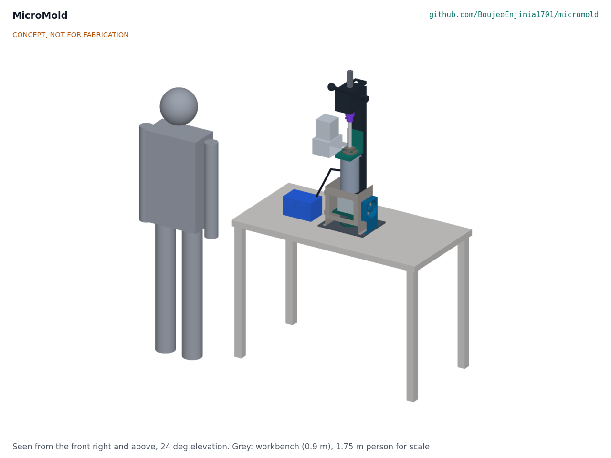
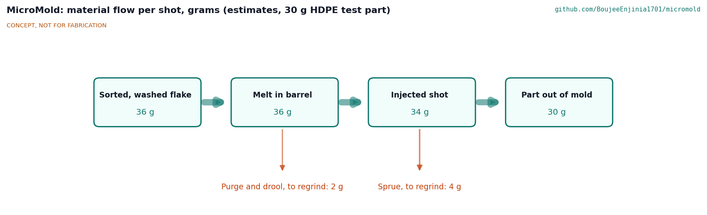
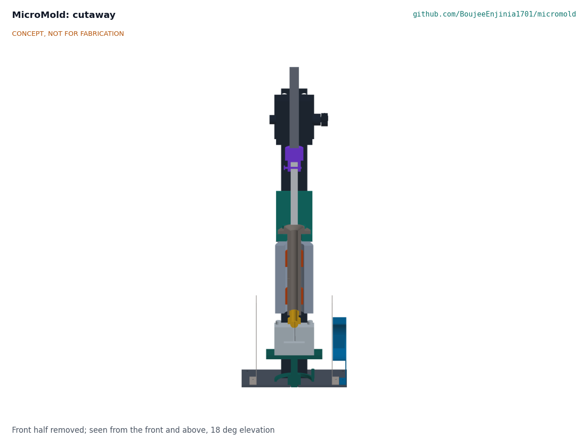
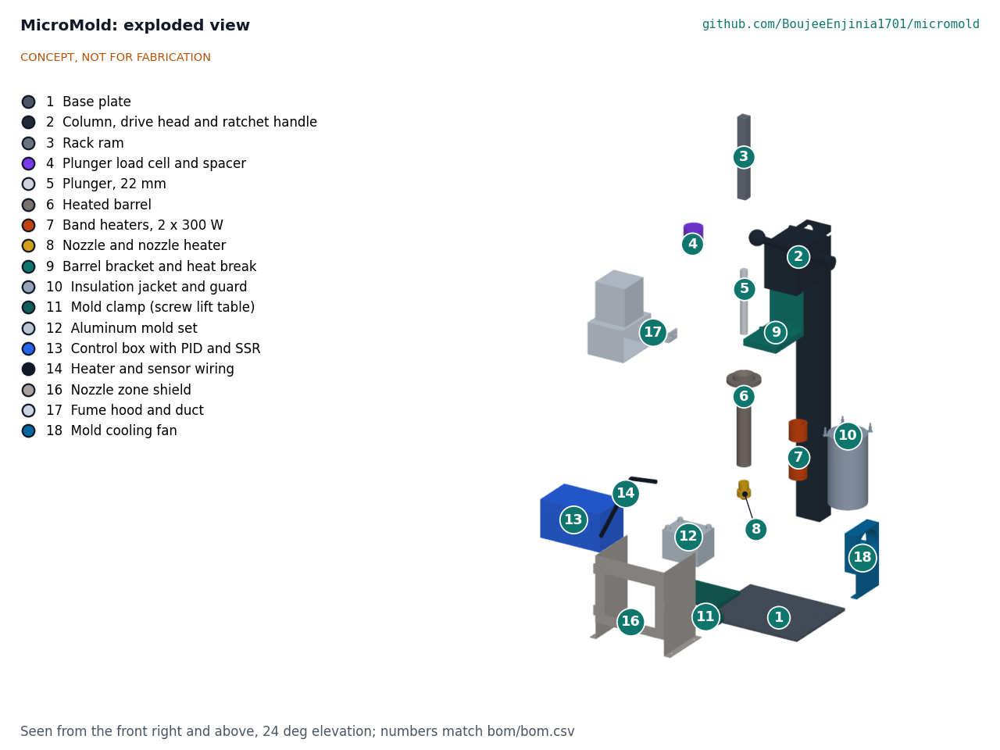

# MicroMold design precis

## Summary

MicroMold is a bench-top, hand-operated plunger injection press for recycled HDPE, PP, LDPE and PS. The rack-and-pinion head of a 1 t arbor press, mounted on a taller steel column and turned by a 450 mm ratchet handle, drives a 22 mm plunger down a vertical steel barrel heated by two 300 W band heaters. Melt leaves a heated 4 mm nozzle into a two-plate aluminum mold that a screw lift table holds against the nozzle, inside a perforated nozzle zone shield, where a small fan cools the mold, and a side hood with a duct fan draws fumes from the funnel. The TRL 3 calculations (MMD-CAL-001 v0.4) give a shot of up to 34.2 g at 8.9 MPa (89 bar) with 250 N on the handle, delivered in about four ratchet pulls; a warm-up of 12.3 min; and about 11.6 parts per hour from 753 W of single-phase power. Value-engineering target: USD 520. Estimated cost of the constructable design: USD 544 for the press (USD 24 over the target), USD 638 with one mold, which is tooling. It weighs about 39.0 kg against a 40 kg target. All figures are estimates. The design was made buildable on 2026-10-01 (MMD-DDR-003) and the prototype build plan is MMD-BLD-001 (`docs/05-build-plan.md`).

*Figure 1. MicroMold on a 0.9 m workbench with a 1.75 m person for scale. Plunger raised for loading; test mold seated on the nozzle inside the shield. Generated from the parametric model `cad/src/model.py`.*

## How it works

1. **Heat.** Two PID controllers drive the barrel zone (two 300 W band heaters) and the nozzle zone (a 100 W band heater) to the set point for the resin, for example 210 °C for HDPE. An insulation jacket and a perforated guard keep the outer surface near 48 °C. The duct fan runs whenever the heaters are on. Feedstock is flake from injection-molded items such as caps, crates and buckets; bottle-grade HDPE is too stiff for a hand press.
2. **Load.** With the plunger raised, the operator pours washed, dried flake into the funnel and tamps each of two or three top-ups down with the press itself, because loose flake has about a third to a half of the density of melt and an untamped charge wastes stroke (MMD-CAL-001, A4).
3. **Soak.** The fresh charge melts above the melt left from the last shot. The barrel holds 2.2 shots, so each charge soaks for about two cycles, about 12 min, against the 9.3 min a 22 mm column of tamped flake needs.
4. **Clamp.** The operator bolts the two mold plates together, sets the mold on the lift table, closes the shield's front and turns the handwheel nut, reached under the front, until the nozzle seats in the mold's spherical seat.
5. **Inject and hold.** The operator fills the mold in about four pulls of the ratchet handle, each moving the plunger about 31 mm, over about 10 s; the pawl holds the ram between pulls. The operator then holds pressure for about 30 s while the gate freezes. A load cell above the plunger shows its force, so the melt pressure (force divided by 380 mm² of plunger area) can be read and logged.
6. **Cool and eject.** With the mold cooling fan running, the plaque cools in the mold for about 1 min, then the mold is lowered, unbolted and opened. Sprue and purge go back to the regrind bin.

*Figure 2. Material flow per shot for the 30 g reference part. All values are estimates: about 2 g of purge and drool and 4 g of sprue return to regrind.*

## Main components

Table 1. Main components. Numbers match `bom/bom.csv` and Figure 4.

| # | Component | Choice | Notes |
| --- | --- | --- | --- |
| 1 | Base plate | 320 x 260 x 8 mm steel, bolted to the bench | Carries the column and the mold clamp; 8 mm from MMD-DDR-003 |
| 2 | Column and drive head | Rack-and-pinion head of a 1 t arbor press on an 80 x 60 x 3 mm steel tube column 0.9 m tall; 450 mm, 1/2 in drive ratchet handle on the pinion shaft | Ratchet added at TRL 3: one pull moves the plunger only about 31 mm |
| 3 | Rack ram | From the arbor press, 28 mm square, 255 mm or longer | 150 mm of travel with the rack still engaged; to confirm on the chosen press |
| 4 | Plunger load cell | 10 kN compression cell with HX711 amplifier and display, on a 10 mm G-11 glass-epoxy spacer | The spacer keeps the cell near 27 °C instead of about 94 °C |
| 5 | Plunger | 22 mm ground steel rod, 200 mm, cross-drilled for a pinned floating coupling | 0.05 to 0.10 mm diametral clearance (22 H8/f7); no seal |
| 6 | Heated barrel | 42 mm steel bar bored and honed to 22 mm, 260 mm long, 80 mm flange and loading funnel | Machine shop part |
| 7 | Band heaters | Two 300 W mica band heaters, 42 mm ID x 50 mm | Barrel zone, one PID loop; 4.5 W/cm²; 300 W from MMD-DDR-002 |
| 8 | Nozzle and nozzle heater | Steel nozzle with a 4 mm orifice, radiused tip; 100 W band heater; tip at 190 mm above the bench | Second PID loop; orifice enlarged from 3 mm at TRL 3 |
| 9 | Barrel shelf and heat break | 20 mm steel shelf and 8 mm back plate welded to the column; the 100 mm flange sits on four mica pads, held by four M8 cap screws | Carries the plunger reaction into the column; back plate from MMD-DDR-003 |
| 10 | Insulation jacket and guard | 25 mm mineral wool in an aluminum skin, perforated steel guard | Skin about 48 °C |
| 11 | Mold clamp | 170 x 126 mm lift table on a Tr20 x 4 screw, raised by a handwheel nut on the base plate; the screw drops through a hole in the bench | Table top 60 to 160 mm: stacks of 30 to 120 mm; screw lift from MMD-DDR-003 |
| 12 | Aluminum mold set | Two 6061 plates, 120 x 90 x 45 mm each, four M10 x 70 cap screws in thread inserts, two dowels, sprue tapering 5 to 7 mm | First mold: test plaque; tooling outside the press budget |
| 13 | Control box | Two PID controllers with set point limit, two 25 A SSRs on a heat sink, fused IEC inlet, double-pole switch, independent thermal cut-out, fan outlet, force display | Mains enclosure; earthed |
| 14 | Heater and sensor wiring | High-temperature wire in glass-fiber sleeving, two K-type thermocouples | 250 °C rated at the barrel |
| 16 | Nozzle zone shield | Perforated steel sides and hinged front around the nozzle and mold | Added at TRL 3 for R11 and melt spit |
| 17 | Fume hood and duct fan | Side hood, 150 x 100 mm face, 100 mm from the funnel axis; 100 mm inline fan; 3 m of duct | Added at TRL 3 (MMD-DDR-001 D9); about 124 m³/h |
| 18 | Mold cooling fan | 120 mm mains axial fan, about 18 W, on an angle bracket on the base plate, blowing on the mold through the shield side | Added by MMD-DDR-002; mold about 47 °C instead of about 92 °C |

Item 15 (hardware and consumables) is in the BOM but not modeled. The general arrangement is drawing MMD-DWG-001 (`cad/drawings/`).

*Figure 3. Section on the injection axis: drive head and ram at the top, load cell and spacer (purple), plunger raised above the funnel, barrel with the two band heaters inside the jacket and guard, bracket (teal), nozzle (gold) seated on the mold with its sprue and plaque cavity, lift table and screw jack on the base plate, and the sides of the nozzle zone shield.*

## Numbers from MMD-CAL-001

All values are first-principles estimates. Assumptions are in MMD-CAL-001, Table 1; the tags point to the lines of `docs/04-calcs/sizing.py` that print them.

Table 2. Key numbers.

| Quantity | Value | Requirement |
| --- | --- | --- |
| Swept volume and shot | 45.6 cm³, 34.2 g HDPE ideal; about 25 g if the fresh charge is not tamped [A1, A2, A4] | R2 at risk |
| Drive ratio and efficiency | 22.5:1; 0.60 design, 0.84 calculated [B1] | |
| Plunger force and melt pressure at 250 N | 3.38 kN and 8.9 MPa (89 bar, 1,288 psi) at 0.60; 12.4 MPa at 0.84 [B2] | R3 met on paper, 11 % margin |
| Stroke per ratchet pull | 31.4 mm per 90° pull; 3.8 pulls per shot [B5] | |
| Overload (700 N on the handle) | 13.2 kN, 34.7 MPa, 1.35 times the press rating [B4] | Parts sized for it |
| Fill pressure, 4 mm nozzle, 10 s fill | About 4.8 MPa [E3] | |
| Mold clamp limit | 45 cm² projected area at 8.9 MPa [D2] | R7 met on paper |
| Warm-up to 220 °C | 12.3 min barrel zone with 2 x 300 W, 6.6 min nozzle [G4] | R5 met on paper |
| Standing losses at 220 °C | 103 W; jacket skin 48 °C [G2, G3] | R11 met on paper |
| Melt soak for a 22 mm column | 9.3 min for tamped flake [H1] | |
| Cycle | 5.2 min, 11.6 parts per hour with the mold fan (soak limited); mold about 47 °C [H3, H6] | R6 met on paper |
| Electrical load | 753 W; 3.3 A at 230 V, 6.3 A at 120 V [I1] | R10 met on paper |
| Energy per shot | About 20 Wh, 0.66 kWh per kg of parts [I2] | |
| Fume hood flow | About 124 m³/h [J1] | R13 met on paper |
| Mass | 39.0 kg without the control box, against 40 kg [K1] | R9 at risk |
| Size | 320 x 260 mm base; handle 1,094 mm above the bench at the start of a pull [K2] | R9 met on size |
| Parts cost | $544 press, against a $520 value-engineering target; $638 with one mold [L1, L2] | R14 USD 24 over the value-engineering target |

## Key design choices

These follow MMD-DDR-001 and MMD-DDR-002. Each was decided by Amish, 2026-09-25: go with recommendation.

- **Drive: rack and pinion from an arbor press (D1).** The rack, pinion and head of a 1 t arbor press on a taller column give 22.5:1 from one bought part. A screw press stays as a variant for small, thick parts. At TRL 3 the fixed handle is replaced by a ratchet handle, because a shot needs 344° of pinion rotation.
- **Vertical barrel, mold below (D2).** Gravity keeps the melt at the nozzle and the operator loads from the top. The mold is changed at bench height.
- **Plunger, not screw (D3).** A reciprocating screw would mix and melt better but needs a motor, gearbox and a much more complex barrel.
- **Two heat zones (D4).** A separate nozzle zone stops the nozzle freezing between shots at the cost of a second PID and SSR.
- **Bolted two-plate aluminum molds on a lift table (D5).** Bolts are slow but cheap and hold 45 cm² at full pressure. A toggle clamp frame (about $40) is a later upgrade. The nozzle tip is now 190 mm above the bench so that 120 mm stacks fit.
- **Load cell for pressure indication (D6).** A number for each shot helps a group learn and record settings. A glass-epoxy spacer keeps the cell cool.
- **First mold: a test plaque (D7).** A 64 x 50 x 6 mm plaque shows fill, shrinkage and surface quality and can be cut into test bars. Product molds follow co-design.
- **Budget (D8, DDR-002).** The budget covers the press and is $520, approved by Amish on 2026-09-26 to cover the priced BOM; molds are tooling, reported separately (R8). On 2026-10-01 Amish set out that the budget is a hypothetical value-engineering target, not a limit. The constructable press is estimated at $544, $24 over the target (MMD-DDR-003).
- **Fume control (D9).** A side hood with a duct fan at the funnel, plus a written condition to run only under it or outdoors.
- **Heaters, mold cooling, mass and feedstock (DDR-002).** Two 300 W barrel bands for a 12.3 min warm-up; a 120 mm fan at the mold so parts eject from a mold near 47 °C; a 40 kg mass target for a bench-bolted press; and injection-grade flake only.
- **Co-design partner type (D10).** The first partner is to be a group that already shreds HDPE or PP; the specific partner and place remain open.

*Figure 4. Exploded view with BOM numbers.*

## Safety

> **Safety:** MicroMold combines mains voltage, surfaces and molten plastic at up to 260 °C, stored pressure in the melt, a long ratchet lever and plastic fumes. It is a concept for a supervised workshop, not a consumer appliance.

- **Hot surfaces and melt.** The barrel, nozzle, mold and purge reach 180 to 260 °C, and molten plastic sticks to skin. The funnel top is a working surface at about 150 °C. Keep the jacket guard and the nozzle zone shield in place, wear heat-resistant gloves, long sleeves and eye protection, and never look down the barrel.
- **Pressure.** Trapped melt can spit from the nozzle or the parting line. An operator hanging body weight on the handle can reach about 35 MPa, which would open the parting line of the test mold (MMD-CAL-001, D3). Close the shield before injecting, keep faces away from the axis and fit a handle stop or a pull limit.
- **Fumes.** Process only HDPE, PP, LDPE and PS within their published ranges. Never heat PVC, which releases hydrogen chloride, or unknown and mixed plastics ([Precious Plastic Academy](https://onearmy.github.io/academy/plastic/basics)). Overheated PS can release styrene. Run the hood fan whenever the heaters are on, or work outdoors. Set point limits of 260 °C are set in both controllers.
- **Mains electricity.** Heaters run at mains voltage next to steel parts. Earth the frame and every metal part, use a fused inlet, double-pole switch and an RCD (30 mA) or GFCI supply, rate wiring at the barrel for 250 °C, and fit an independent thermal cut-out. Mains wiring must be done or checked by a qualified electrician to local electrical code.
- **Moving parts and lever.** The ratchet holds the ram under load: release the pawl only with the handle in hand. The ram and pinion can pinch; keep hands clear of the rack. The mold cooling fan runs at mains voltage: keep its finger guard fitted and its lead clear of the hot barrel and nozzle.
- **Fire.** Unattended heaters are a fire risk. Switch off at the inlet after use; keep flake and rags away from the barrel.
- **Product use.** Recycled parts of unknown history are not suitable for food contact, toys for young children, medical or safety-critical uses.

## Open questions after TRL 3

- Ram length and travel of real 1 t arbor presses: is a 255 mm ram with 150 mm of engaged travel available, and how heavy is the head? This sets R9, now at 39.0 kg against 40 kg.
- How dense is a tamped, part-melted charge at injection time? This sets R2.
- Is the fan enough to keep the mold near 47 °C in practice, and how dense is the charge after the shorter soak-limited cycle? This sets R6.
- Nozzle temperature for each resin, and mold design rules for the group's own machinists: draft, venting, gate size and ejection.
- Which first products would sell locally? This needs the co-design partner (MMD-DDR-001, O1 and O2).

Concept media: [blueprint sheet](../media/concept-blueprint.pdf), [interactive 3D model](../media/viewer.html). General arrangement: [MMD-DWG-001](../cad/drawings/MMD-DWG-001.pdf).
