# MicroMold prototype build plan

**Plan, not yet built.** How to build the first proof-of-concept prototype, component by component. Building and testing to it is TRL 4 work. Decisions still to be made are kept in the design decisions register ([docs/06-design-decisions.md](06-design-decisions.md)), not here.

## 1. What you are building

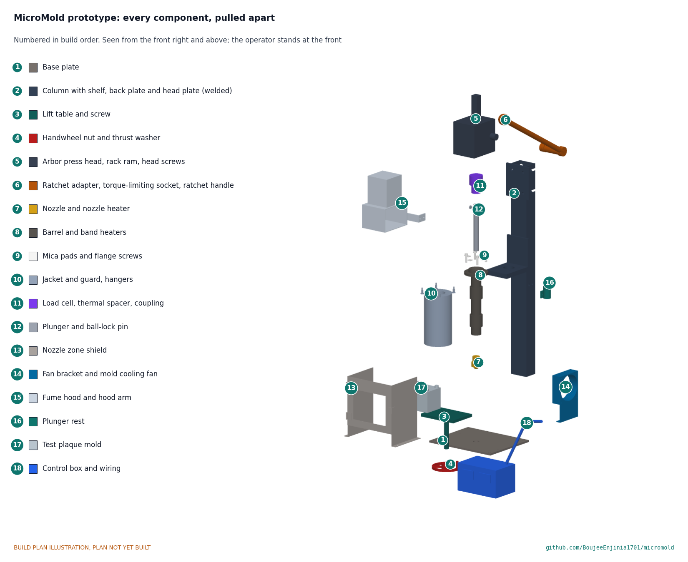

*Figure 1. Every component pulled apart and numbered in build order.*

The prototype is one bench-top MicroMold press: a steel column welded to a base plate, carrying the head of a 1 t arbor press at the top and a heated steel barrel on a shelf half way up. A ratchet handle turns the press's pinion, the rack ram pushes a 22 mm plunger down the barrel, and melt leaves a nozzle into a two-plate aluminium mold that a screw lift table holds up against it, inside a perforated shield. A fan cools the mold and a side hood draws fumes from the funnel. Figure 1 shows the 17 components in the order you make or fit them. The base plate, column weldment, lift table, jacket, shield, fan bracket, hood and arm are cut, drilled, folded and welded in a small workshop; the coupling, spacer and plunger need only a drill press; the barrel, nozzle and mold come from a local machine shop; the press head, handwheel and lever hub are bought and modified; the heaters, load cell, fans, control box parts and fixings are bought. The parts cost about USD 544 for the press and USD 638 with the test mold, from the bill of materials.

> **Safety:** MicroMold runs mains-voltage heaters on a steel frame and holds molten plastic at up to 260 °C under pressure. All mains wiring must be done or checked by a qualified electrician to local code, with an earthed frame, a fused inlet, a double-pole switch, a 30 mA RCD (or GFCI) supply and an independent thermal cut-out. Wear heat-resistant gloves, long sleeves and eye protection at the hot zone, keep the shield shut while injecting, and heat only HDPE, PP, LDPE and PS, under the hood or outdoors; never PVC or unknown plastics. Welding needs a welding helmet, gloves and a fire-safe area. The finished press weighs about 39 kg: lift it with two people.

## 2. What changed to make it buildable

The concept showed what the press does; some of its parts could not be made or fixed as drawn. Each change below keeps what the press does, and all of them are recorded in decision record MMD-DDR-003, open for Amish's review.

*Table 1. Changes from the concept.*

| Component | The concept had | The buildable design has | Why |
| --- | --- | --- | --- |
| Arbor press head | A block overlapping the column by 30 mm, with no fixing | The head cut from its frame and bolted to a plate welded to the column front, four countersunk screws reached through holes in the column (Figure 9) | A 1 t arbor press is one casting; the plate carries the head's thrust into the column corners |
| Barrel bracket | A plate cutting into the column wall, fixed only to its thin front wall; no mica pads in the stack | A 20 mm shelf welded to the column face and a back plate welded up the column corners; four mica pads under the flange (Figure 14) | The thin tube wall would bend; the pads are the heat break the calculations count on |
| Barrel flange | No fixing; no room for screws inside the funnel | A 100 mm flange held by four M8 cap screws; the funnel 64 mm across instead of 80 mm (Figure 14) | A hex key reaches the screws past the funnel |
| Nozzle | Standing under the barrel, with no joint | Screwed into an M30 x 1.5 thread in the barrel end; a spherical tip that seats in the mold (Figure 13) | The nozzle comes out for cleaning; the seat locates and seals the mold |
| Jacket and guard | One sleeve floating round the barrel | Two half shells that close round the barrel, hung from the shelf on four tabs, spacers and M5 screws (Figure 16) | A one-piece sleeve cannot pass the nozzle once the barrel is in; the hangers hold it clear of the barrel and heaters |
| Load cell and plunger | Stacked with no fixings and no way to lift the plunger | A drilled coupling under a glass-epoxy spacer, with no screw crossing the spacer; the plunger hangs on a ball-lock pin (Figure 18) | Keeps the load cell's thermal break and lets the plunger float in line with the bore |
| Screw lift | A block with a crank and no mechanism, in a space too low for any 100 mm screw jack | A screw welded under the table, turned by a handwheel nut on the base plate, dropping through a hole in the bench (Figure 7) | The only screw lift that keeps the 60 to 160 mm table range and the 120 mm mold stack |
| Mold | Bolts with nuts under the lower plate, so it could not sit flat; no alignment | Cap screws into thread inserts; two dowels; the sprue taper turned the right way (Figure 27) | Sits flat on the table and closes the same way every time |
| Shield | Sides floating 52 mm above the bench; no hinge | Sides on folded feet screwed to the base plate; the front on two hinges and a latch (Figure 21) | A fixed guard; the handwheel is reached under the closed front |
| Fan bracket | Touching only the fan's lower edge | A plate with an intake hole, four screws through the fan's corners (Figure 23) | Holds the fan and lets it breathe |
| Fume hood | Floating beside the funnel | An L-shaped arm to the column on rivnuts (Figure 25) | A tube wall cannot be reached from inside |
| Base plate | 12 mm | 8 mm | Keeps the press at 39.0 kg, under its 40 kg target, after the added plates and fixings; the base plate does not carry the injection force |

## 3. Making the components

Make and check each component before the assembly step that needs it. Sizes are in millimetres. "Front" is the operator's side; "left" and "right" are as seen by the operator. Workshop tolerance is 0.5 mm unless a step says otherwise; drawings do not carry tolerances before TRL 4.

### 3.1 Base plate

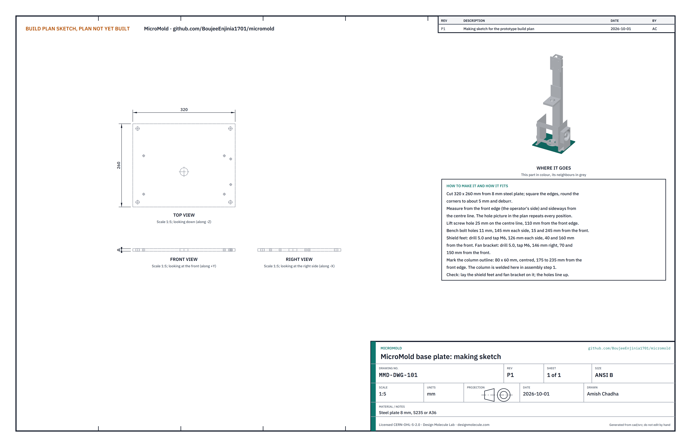

*Figure 2. Base plate making sketch (MMD-DWG-101).*

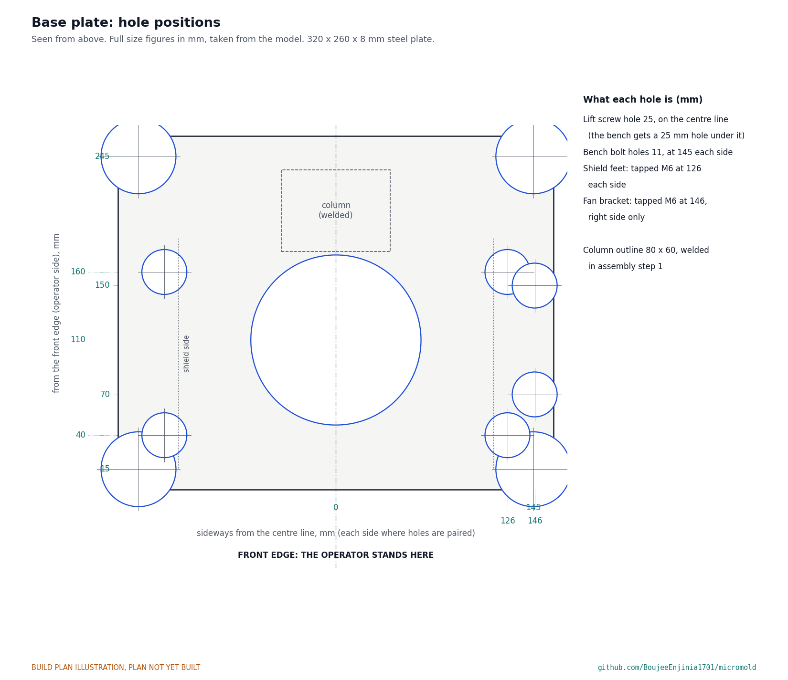

*Figure 3. Every hole, full size figures, measured from the front edge and sideways from the centre line.*

**What it is and what it is made from.** The plate the whole press stands on, bolted to the bench. Steel plate 8 mm thick, S235 or A36, cut to 320 x 260 mm.

**How to make it.**

1. Cut the blank to 320 x 260 mm, square. Round the corners to about 5 mm and deburr all edges.
2. Scribe a centre line front to back. Mark the front edge (the operator's side).
3. Mark every hole from Figure 3: distances back from the front edge, sideways from the centre line.
4. Lift screw hole: 25 mm, on the centre line, 110 back from the front edge.
5. Bench bolt holes: four 11 mm holes, 145 each side, 15 and 245 back.
6. Shield foot holes: four holes 126 each side, 40 and 160 back. Drill 5.0 mm and tap M6.
7. Fan bracket holes: two holes 146 to the right, 70 and 150 back. Drill 5.0 mm and tap M6.
8. Scribe the column outline: 80 wide, centred, from 175 to 235 back.
9. Deburr every hole on both faces.

**How it fits the parts next to it.** The column is welded on its outline (step 1). The handwheel nut turns on a thrust washer over the lift screw hole (Figure 7). The shield feet and the fan bracket foot screw down onto it (Figures 21 and 23). Four M10 bolts hold it to the bench, over a 25 mm hole drilled through the bench under the lift screw hole.

**Check before moving on.** Lay the shield feet and fan bracket on the plate and look through each hole: the holes must line up without forcing a screw.

### 3.2 Column with shelf, back plate and head plate

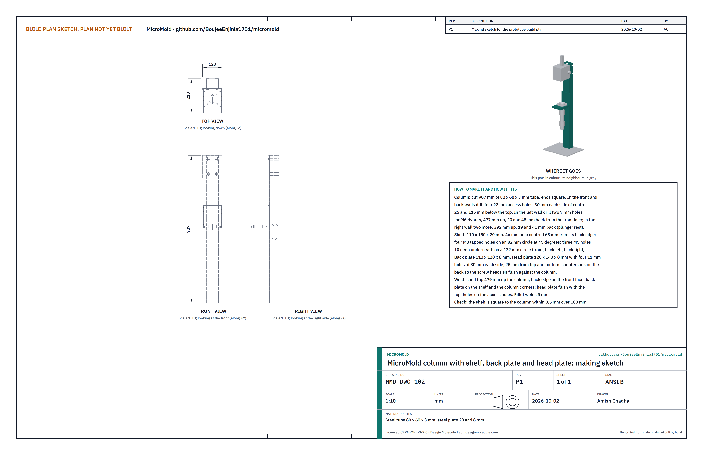

*Figure 4. Column weldment making sketch (MMD-DWG-102).*

**What it is and what it is made from.** The spine of the press: a steel tube that carries the press head at its top and the barrel on a shelf half way up, with the plates welded to it that hold them. Steel tube 80 x 60 x 3 mm; steel plate 20 mm (shelf) and 8 mm (back plate and head plate).

**How to make it.**

1. Column: cut 907 mm of tube with square ends. The 80 mm faces are the front and back.
2. In the front and back walls, drill four 22 mm access holes through both walls in line: 30 each side of the centre line, 25 and 115 below the top end.
3. In the left wall, drill two 9 mm holes for M6 rivnuts, 477 up from the bottom end, 20 and 45 back from the front face. Fit the rivnuts.
4. Shelf: cut 110 x 150 mm from 20 mm plate. Drill a 46 mm hole centred across the width, 65 from one short edge (the back edge). Around it, on an 82 mm circle, drill and tap four M8 holes through, at 45 degrees to the edges. Underneath, drill and tap four M5 holes 10 deep on a 132 mm circle round the same centre, at 45 degrees to the edges.
5. Back plate: cut 110 x 120 mm from 8 mm plate.
6. Head plate: cut 120 x 140 mm from 8 mm plate. Drill four 11 mm holes, 30 each side of centre, 25 from the top and bottom edges. Countersink them 90 degrees on one face (the back face) so an M10 countersunk screw sits flush.
7. Weld, in this order, with 5 mm fillet welds: the head plate to the column front, back face to the column, top edge flush with the column top, its holes in line with the access holes (weld down both column corners and across the top); the shelf with its back edge against the column front and its top face 479 up from the column bottom, centred, square both ways (weld top and bottom); the back plate on the shelf against the column (weld to the shelf and down both column corners).
8. Clean up spatter and paint everything except the shelf top.

**How it fits the parts next to it.** The column stands on the base plate, welded all round (step 1). The press head bolts to the head plate (Figure 9). The barrel flange sits on mica pads on the shelf (Figure 14), and the jacket hangs under it (Figure 16). The lift table's back edge runs 2 mm in front of the column face (Figure 6). The hood arm bolts to the rivnuts (Figure 25).

**Check before moving on.** The shelf is square to the column within 0.5 mm over 100 mm, both ways; an M10 screw passes through each access hole into each head plate hole.

### 3.3 Lift table and screw

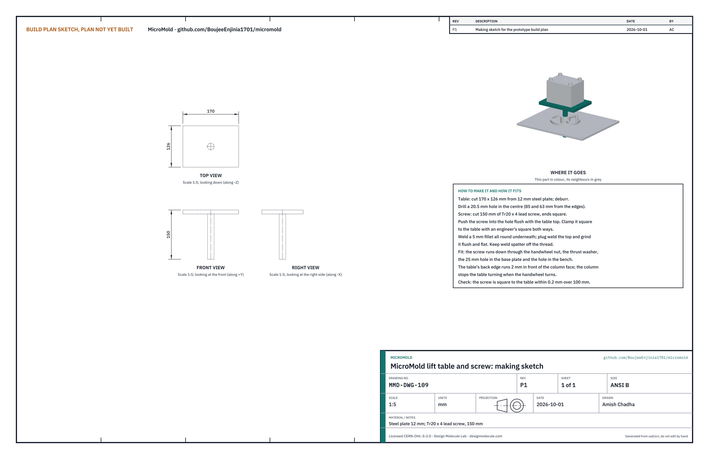

*Figure 5. Lift table and screw making sketch (MMD-DWG-109).*

**What it is and what it is made from.** The table the mold stands on, with its lifting screw welded underneath. Steel plate 12 mm; Tr20 x 4 trapezoidal lead screw, 150 mm.

**How to make it.**

1. Cut the table 170 x 126 mm from 12 mm plate and deburr it.
2. Drill a 20.5 mm hole in the centre, 85 from the sides and 63 from the front and back edges.
3. Cut 150 mm of Tr20 x 4 screw with square ends.
4. Push the screw into the hole flush with the table top, and clamp it square to the table both ways with an engineer's square.
5. Weld a 5 mm fillet all round underneath. Plug weld the top and grind it flush and flat. Keep weld spatter off the thread.

**How it fits the parts next to it.**

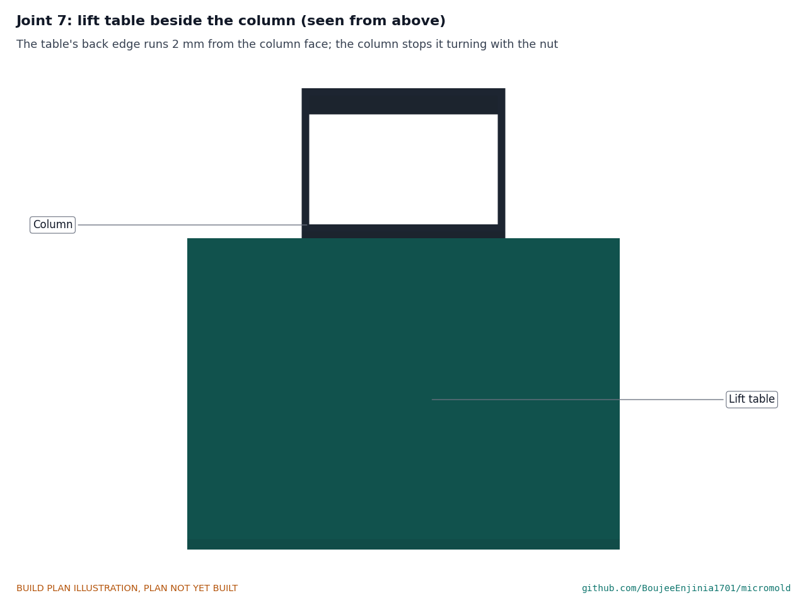

*Figure 6. The table's back edge runs 2 mm in front of the column face; when the handwheel turns, the column stops the table turning with it.*

The screw runs down through the handwheel nut, the thrust washer, the base plate and the bench (Figure 7). The mold stands on the table.

**Check before moving on.** The screw is square to the table within 0.2 mm over 100 mm.

### 3.4 Handwheel nut

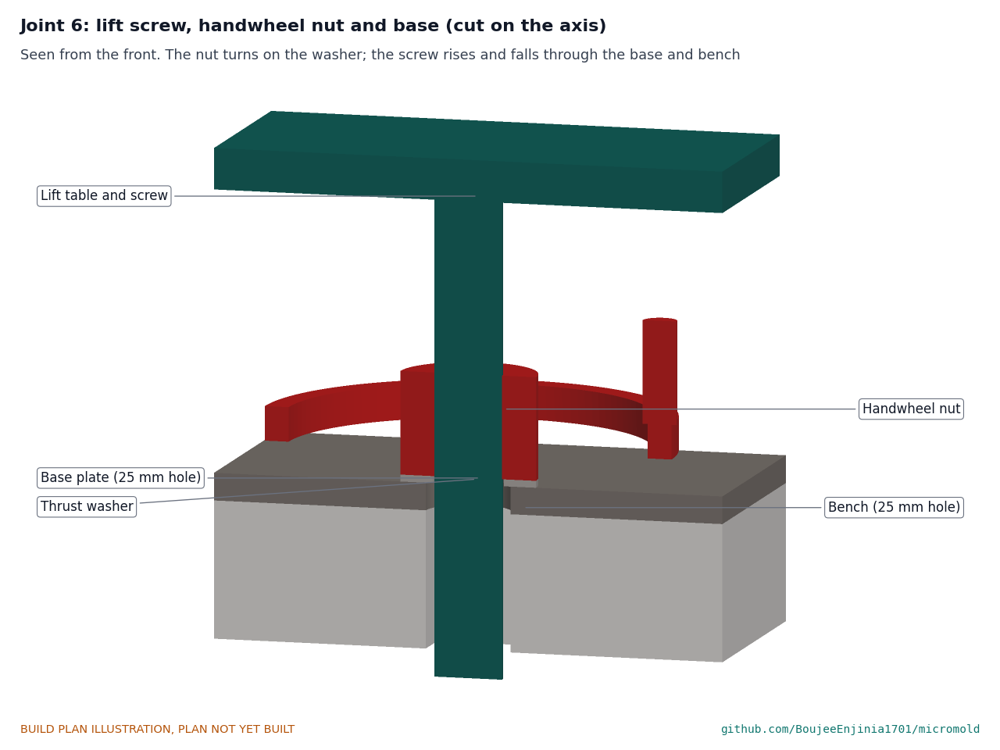

*Figure 7. The nut turns on the thrust washer; the screw rises and falls through the base plate and the bench.*

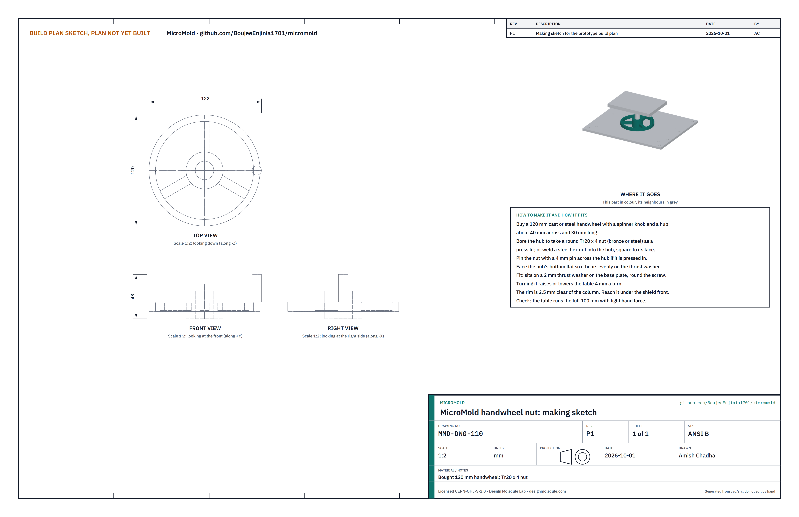

*Figure 8. Handwheel nut making sketch (MMD-DWG-110).*

**What it is and what it is made from.** The wheel that raises and lowers the table: a bought handwheel with a Tr20 x 4 nut fitted in its hub. A 120 mm cast or steel handwheel with a spinner knob and a hub about 40 mm across and 30 long; a round Tr20 x 4 nut in bronze or steel.

**How to make it.**

1. Bore the hub to take the nut as a press fit, or weld a steel nut into the hub square to its face.
2. If pressed in, pin the nut with a 4 mm pin across the hub.
3. Face the hub's bottom flat so it bears evenly on the thrust washer.

**How it fits the parts next to it.** The hub sits on a 2 mm thrust washer on the base plate, round the screw. One turn moves the table 4 mm; the table runs from 60 to 160 above the bench. The rim runs 2.5 mm clear of the column and is reached under the shield's front edge, which is 60 above the bench, with the front shut. With the table at its lowest, the screw end is 50 mm below the underside of a 40 mm bench.

**Check before moving on.** On a trial fit the table runs its full 100 mm with light hand force.

### 3.5 Arbor press head (bought, cut from its frame)

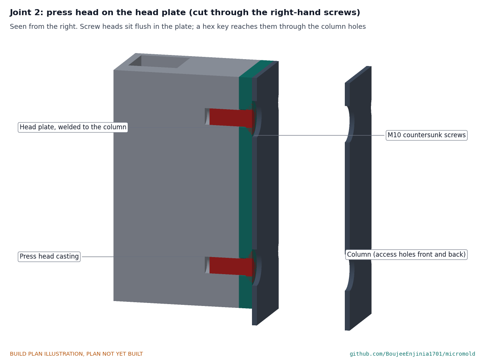

*Figure 9. The countersunk screw heads sit flush in the head plate; a hex key reaches them through the holes in the column.*

**What it is and what it is made from.** The rack, pinion and head casting of a 1 t arbor press. The ram must be 28 mm square and 255 mm or longer, with 150 mm of travel while the rack still meets the pinion.

**How to make it.**

1. Take the lever and its hub off the pinion shaft; keep the hub for the ratchet adapter (section 3.6).
2. Cut the head from the press frame just below the head casting with a cutting disc, and grind the back face flat where it will meet the head plate.
3. Using the head plate as a template, mark four holes on the back face (60 apart across, 90 apart up and down, centred on the ram's centre line across). Drill 8.5 mm and tap M10, 20 deep.

**How it fits the parts next to it.** The back face sits flat on the head plate. Four M10 x 25 countersunk screws go in from behind the head plate, through the column's access holes, with medium threadlocker. The ram's centre is 65 in front of the column face, over the barrel bore.

**Check before moving on.** The ram slides its full travel without binding, and its end face is square to the base plate within 0.5 mm over its width (checked at step 6).

### 3.6 Ratchet adapter

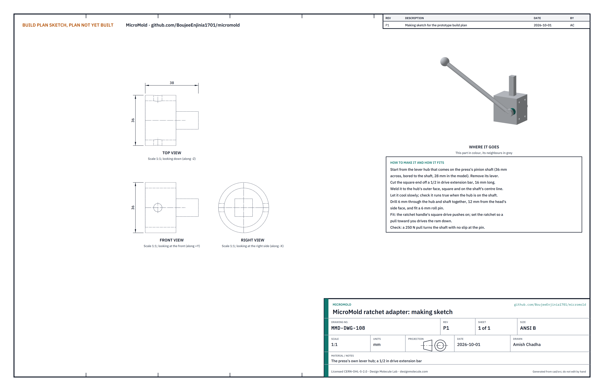

*Figure 10. Ratchet adapter making sketch (MMD-DWG-108).*

**What it is and what it is made from.** The piece that lets a 1/2 in drive ratchet handle turn the pinion. The press's own lever hub (about 36 mm across, bored to the shaft) and the square end of a 1/2 in drive extension bar.

**How to make it.**

1. Cut the square end off a 1/2 in drive extension bar, 16 long.
2. Weld it to the hub's outer face, square to the face and on the shaft's centre line. Let it cool slowly; check it runs true with the hub on the shaft.
3. With the hub on the shaft, drill 6 mm through hub and shaft together, 12 from the head's side face, and fit a 6 mm roll pin.

**How it fits the parts next to it.** The hub slides onto the right-hand end of the pinion shaft, pinned. The ratchet handle's square drive pushes onto the square; its 450 mm handle starts a pull 30 degrees above level.

**Check before moving on.** A 250 N pull at the handle turns the shaft with no movement at the pin.

### 3.7 Nozzle

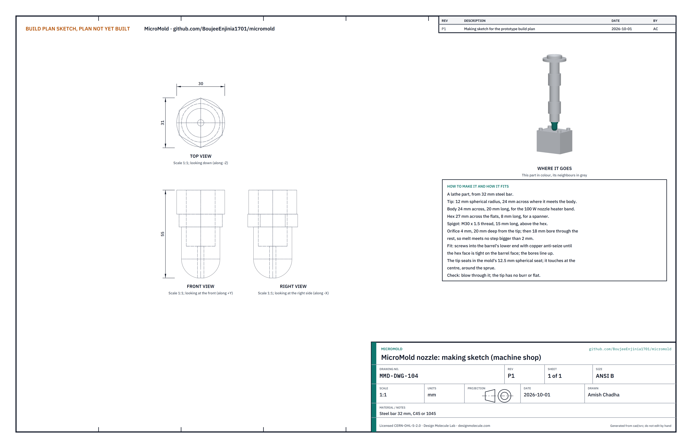

*Figure 11. Nozzle making sketch (MMD-DWG-104).*

**What it is and what it is made from.** The short heated tip that melt leaves through into the mold. Turned from 32 mm steel bar, C45 or 1045, by a machine shop.

**How to make it.**

1. Turn the tip to a 12 mm spherical radius, 24 across where it meets the body.
2. Turn the body to 24 across and 20 long, for the 100 W nozzle heater band.
3. Leave a hex 27 across the flats and 8 long above the body.
4. Turn and thread the spigot above the hex: M30 x 1.5, 15 long.
5. Drill the orifice 4 mm, 20 deep from the tip, then 18 mm through the rest, so melt meets no step bigger than 2 mm.

**How it fits the parts next to it.** The spigot screws into the barrel's lower end with copper anti-seize until the hex face is tight on the barrel face. The heater band clamps round the body. The tip sits in the mold's spherical seat, touching round the sprue (Figure 13).

**Check before moving on.** Blow through it; the tip has no burr or flat.

### 3.8 Barrel

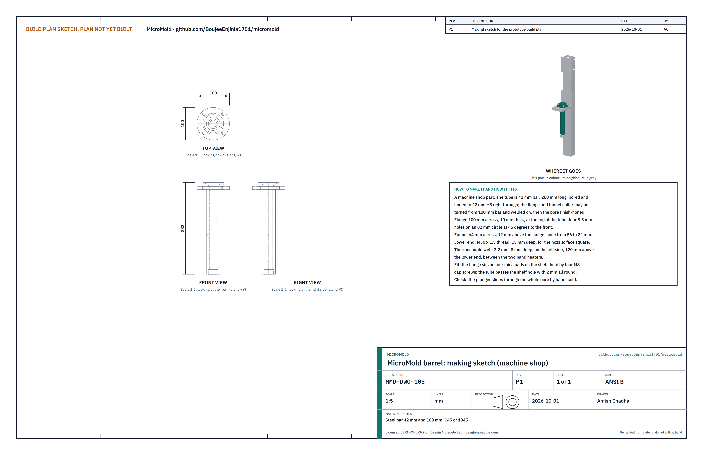

*Figure 12. Barrel making sketch (MMD-DWG-103).*

**What it is and what it is made from.** The heated steel tube the plastic melts in, with a flange that sits on the shelf and a funnel for loading. Steel bar 42 mm and 100 mm, C45 or 1045, by a machine shop.

**How to make it.**

1. Bore and hone 42 mm bar, 260 long, to 22 mm H8 right through.
2. Turn the flange (100 across, 10 thick) and the funnel collar (64 across, 12 above the flange, a cone from 56 to 22) from 100 mm bar, weld them to the top of the tube, then finish-hone the bore. A shop may instead turn the whole barrel from 100 mm bar.
3. Drill four 8.5 mm holes in the flange on an 82 mm circle, at 45 degrees to the front.
4. Thread the lower end M30 x 1.5, 15 deep, face square.
5. Drill a 3.2 mm thermocouple well 8 deep in the left side, 120 above the lower end, between the two heater bands.

**How it fits the parts next to it.**

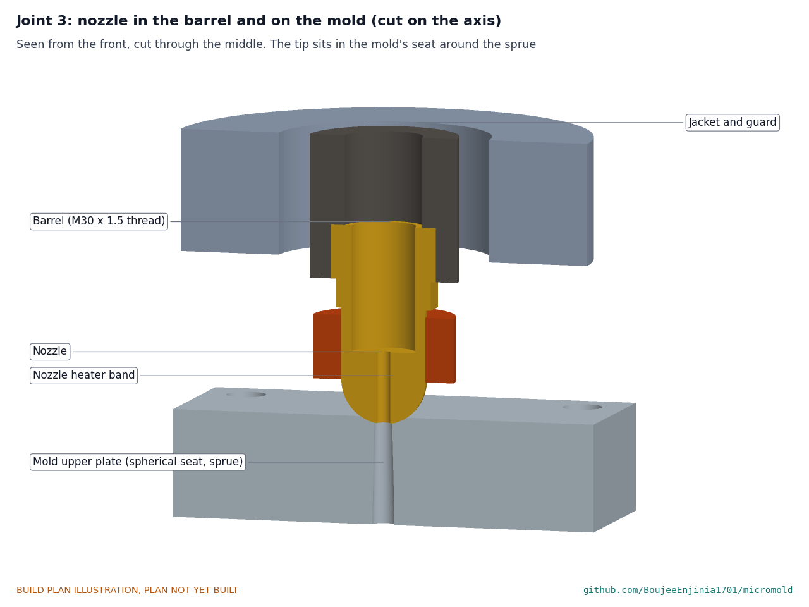

*Figure 13. The nozzle screws into the barrel's lower end; its tip sits in the mold's spherical seat round the sprue.*

The two 300 W band heaters clamp round the tube, centred 60 and 180 above its lower end, with their leads to the back. The tube passes down through the shelf's 46 mm hole with 2 mm all round, and the flange sits on four mica pads:

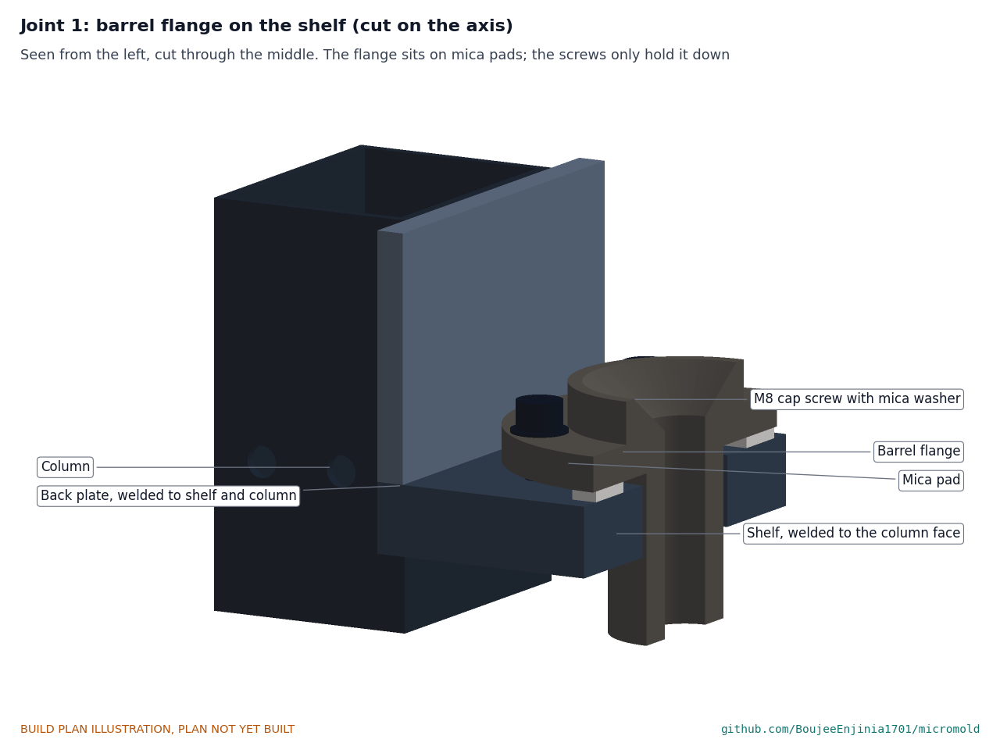

*Figure 14. Joint 1: the flange sits on four 15 x 15 x 3 mm mica pads on the shelf; four M8 cap screws with mica washers hold it down but carry no injection load.*

**Check before moving on.** The plunger slides through the whole bore by hand, cold; the nozzle bore lines up with the barrel bore.

### 3.9 Jacket and guard

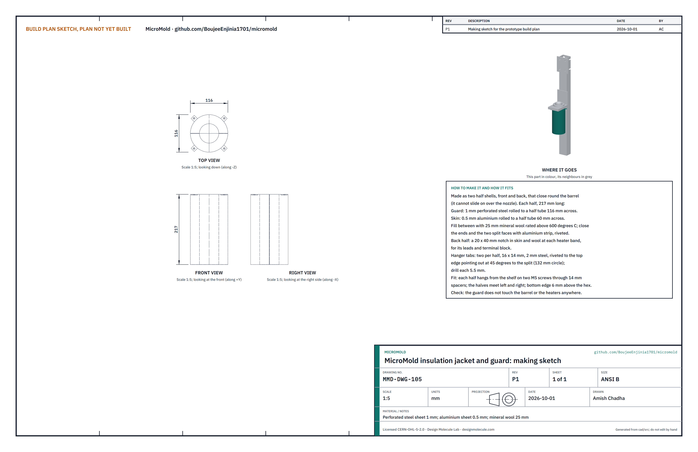

*Figure 15. Jacket and guard making sketch (MMD-DWG-105).*

**What it is and what it is made from.** The insulated sleeve round the heated barrel that keeps its outside near 48 °C, made as two half shells (front and back) because a one-piece sleeve cannot pass the nozzle once the barrel is in. Perforated steel sheet 1 mm (outside), aluminium sheet 0.5 mm (inside skin) and 25 mm mineral wool between them.

**How to make it.** Make each half 217 long:

1. Roll the perforated steel to a half tube 116 across.
2. Roll the aluminium skin to a half tube 60 across.
3. Fill between them with mineral wool rated above 600 °C and close the two ends and the two split faces with aluminium strip, riveted to the guard.
4. In the back half, cut a 20 x 40 mm notch in the skin and wool at each heater band, for its leads.
5. Rivet two 16 x 14 mm tabs of 2 mm steel to the top edge of each half, pointing out at 45 degrees to the split (on the same 132 mm circle as the shelf's M5 holes). Drill each tab 5.5 mm.

**How it fits the parts next to it.**

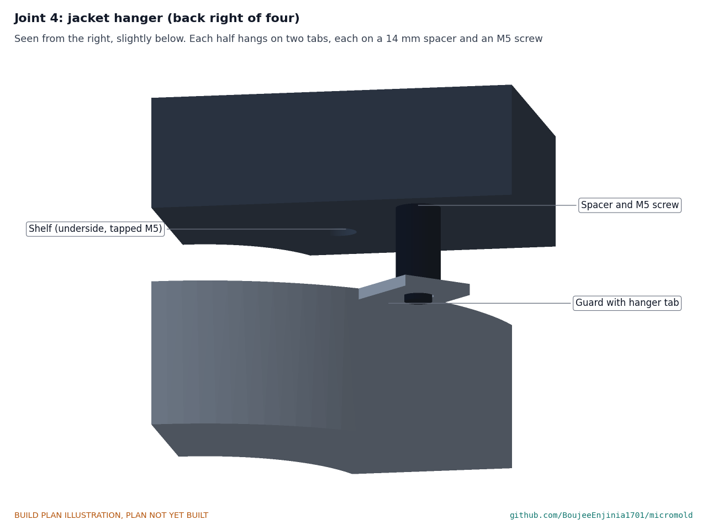

*Figure 16. Each half hangs on two tabs, each on a 14 mm spacer and an M5 x 25 screw into the shelf.*

The halves meet at the left and right; the bottom edge sits 6 above the nozzle hex, and the guard is clear of the barrel and heaters all round.

**Check before moving on.** Nothing inside touches the barrel or the heaters.

### 3.10 Plunger coupling and thermal spacer

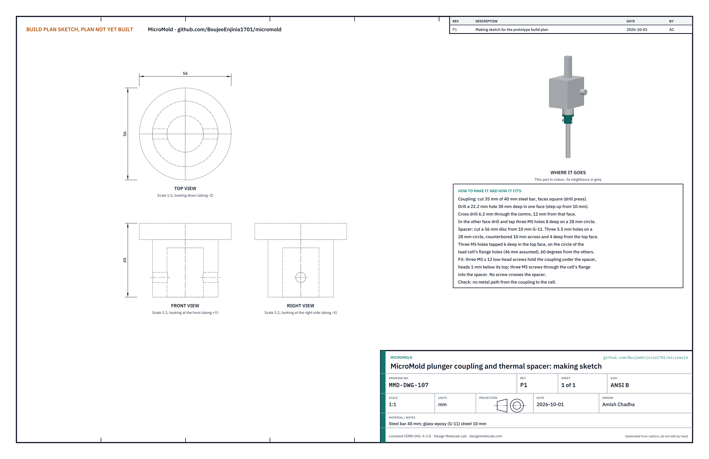

*Figure 17. Plunger coupling and thermal spacer making sketch (MMD-DWG-107).*

**What they are and what they are made from.** The coupling holds the plunger under the load cell; the spacer stops the hot plunger heating the load cell. Steel bar 40 mm; glass-epoxy (G-11) sheet 10 mm.

**How to make them.**

1. Coupling: cut 35 mm of 40 mm bar with square faces. In one face drill a 22.2 mm hole 30 deep (step up from 10 mm on a drill press). Cross drill 6.2 mm through the centre, 12 from that face.
2. In the other face, drill and tap three M5 holes 8 deep on a 28 mm circle, 120 degrees apart.
3. Spacer: cut a 56 mm disc from 10 mm G-11. Drill three 5.5 mm holes on a 28 mm circle and counterbore them 10 across and 4 deep from the top face.
4. In the spacer's top face, drill and tap three M5 holes 6 deep on the circle of the load cell's flange holes (46 mm assumed), turned 60 degrees from the first three.

**How they fit the parts next to them.**

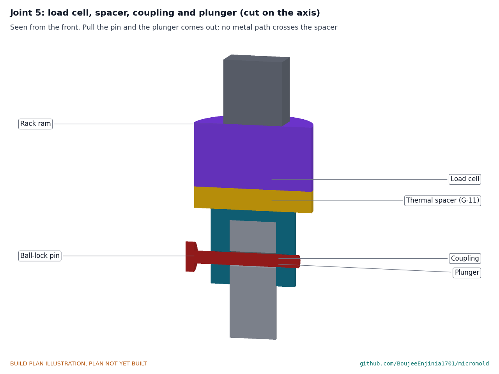

*Figure 18. The load cell's stud screws into the ram end; the spacer and coupling hang under it; the plunger hangs on a ball-lock pin.*

Three M5 x 12 low-head screws go down through the spacer's counterbores into the coupling; their heads sit 1 mm below the spacer's top face. Three M5 screws go down through the load cell's flange into the spacer's tapped holes and stop 4 mm short of the coupling. No screw crosses the spacer, so no metal path carries heat to the load cell. Drill and tap the ram end M12, 20 deep, on its centre, for the load cell's stud. The plunger's top 30 mm goes into the coupling and a 6 mm ball-lock pin goes through both; the plunger's 7 mm hole lets it float in line with the bore.

**Check before moving on.** With a meter, there is no electrical path from the coupling to the load cell.

### 3.11 Plunger

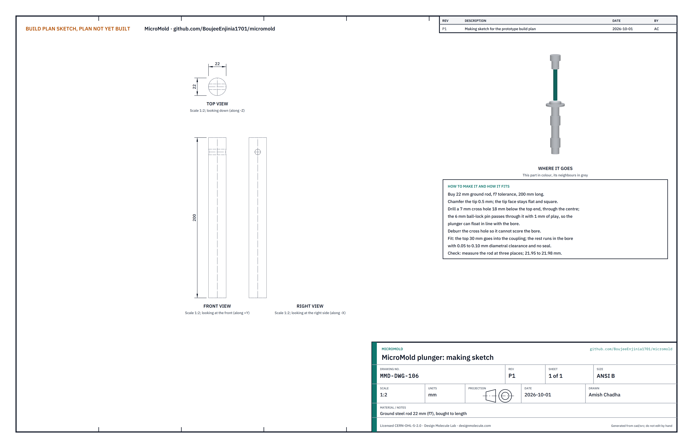

*Figure 19. Plunger making sketch (MMD-DWG-106).*

**What it is and what it is made from.** The rod that pushes melt out of the barrel. Ground steel rod 22 mm, f7 tolerance, bought 200 mm long.

**How to make it.**

1. Chamfer the tip 0.5 mm; keep the tip face flat and square.
2. Drill a 7 mm cross hole through the centre, 18 below the top end, and deburr it so it cannot score the bore.

**How it fits the parts next to it.** It hangs in the coupling on the ball-lock pin (Figure 18) and runs in the bore with 0.05 to 0.10 mm diametral clearance and no seal. Raised, its tip is 30 above the barrel top; at full stroke it is 120 down the bore.

**Check before moving on.** Measure the rod at three places: 21.95 to 21.98 mm.

### 3.12 Nozzle zone shield

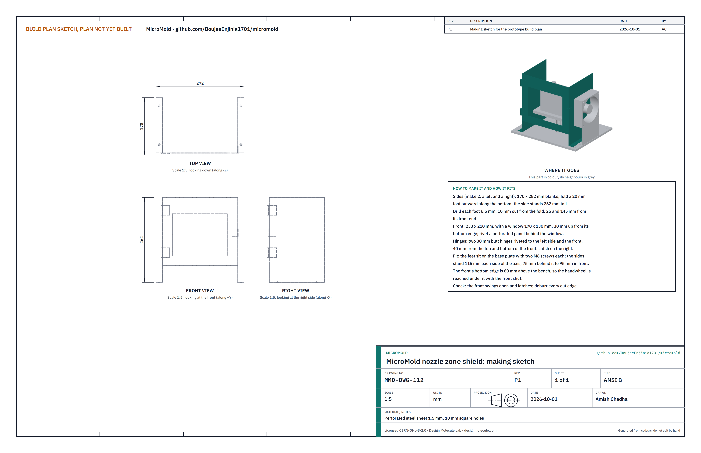

*Figure 20. Nozzle zone shield making sketch (MMD-DWG-112).*

**What it is and what it is made from.** The perforated guard round the nozzle and mold, with a hinged front. Perforated steel sheet 1.5 mm with 10 mm square holes; two 30 mm butt hinges; a sprung latch.

**How to make it.**

1. Sides (make 2, a left and a right): cut 170 x 282 mm blanks. Fold a 20 mm foot outward along one long edge, 90 degrees, so the side stands 262 tall.
2. Drill each foot 6.5 mm, 10 out from the fold, 25 and 145 from its front end.
3. Front: cut 233 x 210 mm with a window 170 x 130 mm, 30 up from the bottom edge and centred. Rivet a perforated panel behind the window.
4. Rivet the two hinges to the left side's front edge and the front, 40 from the top and the bottom of the front. Rivet the latch to the right side and the front.
5. Deburr every cut edge.

**How it fits the parts next to it.**

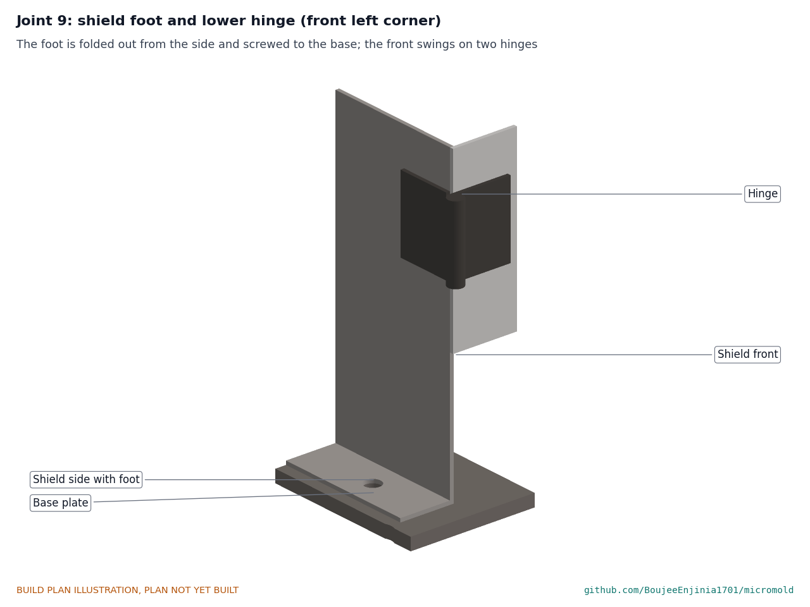

*Figure 21. Each foot is screwed to the base plate with two M6 screws; the front swings open on its hinges.*

The sides stand 115 each side of the barrel axis, from 75 behind it to 95 in front. The front's bottom edge is 60 above the bench, so the handwheel is reached under it with the front shut.

**Check before moving on.** The front swings open fully and latches shut.

### 3.13 Fan bracket

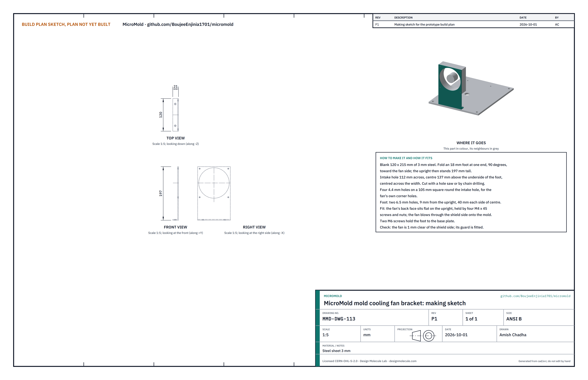

*Figure 22. Fan bracket making sketch (MMD-DWG-113).*

**What it is and what it is made from.** The plate that holds the mold cooling fan beside the shield. Steel sheet 3 mm.

**How to make it.**

1. Cut a blank 120 x 215 mm. Fold an 18 mm foot at one end, 90 degrees, toward the fan side; the upright stands 197 tall.
2. Cut the 112 mm intake hole, its centre 137 above the underside of the foot, centred across the width.
3. Drill four 4.4 mm holes on a 105 mm square round the intake hole, for the fan's corner holes.
4. Drill two 6.5 mm holes in the foot, 9 from the upright, 40 each side of centre.

**How it fits the parts next to it.**

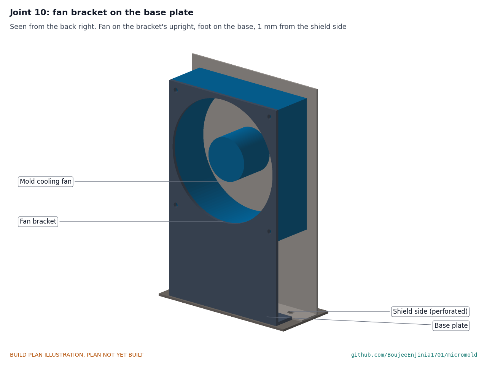

*Figure 23. The fan's back sits flat on the upright on four M4 x 45 screws; the foot is screwed to the base plate; the fan is 1 mm from the shield side.*

**Check before moving on.** The fan's finger guard is fitted on its intake side, and the fan blows toward the mold.

### 3.14 Fume hood and hood arm

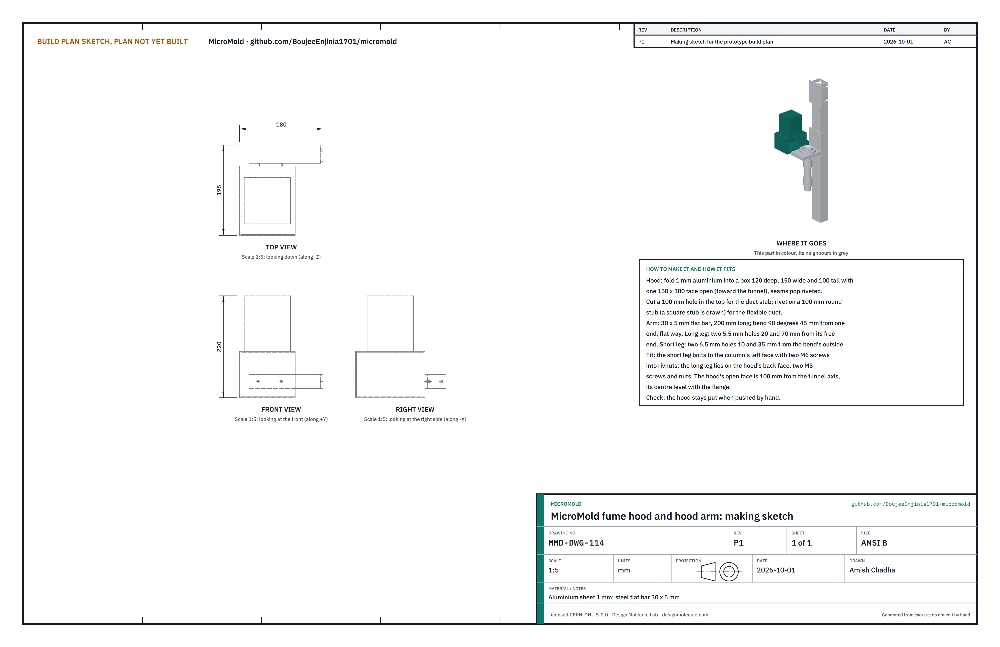

*Figure 24. Fume hood and hood arm making sketch (MMD-DWG-114).*

**What they are and what they are made from.** The hood that draws fumes from the funnel into a duct, and the arm that holds it to the column. Aluminium sheet 1 mm; steel flat bar 30 x 5 mm.

**How to make them.**

1. Hood: fold a box 120 deep, 150 wide and 100 tall with one 150 x 100 face open; pop rivet the seams.
2. Cut a 100 mm hole in the top and rivet on a 100 mm round duct stub (the model draws it square).
3. Arm: cut 200 mm of flat bar and bend it 90 degrees the flat way, 45 from one end.
4. Long leg: two 5.5 mm holes, 20 and 70 from its free end. Short leg: two 6.5 mm holes, 10 and 35 from the outside of the bend.
5. Drill the hood's back face through the long leg's holes.

**How they fit the parts next to them.**

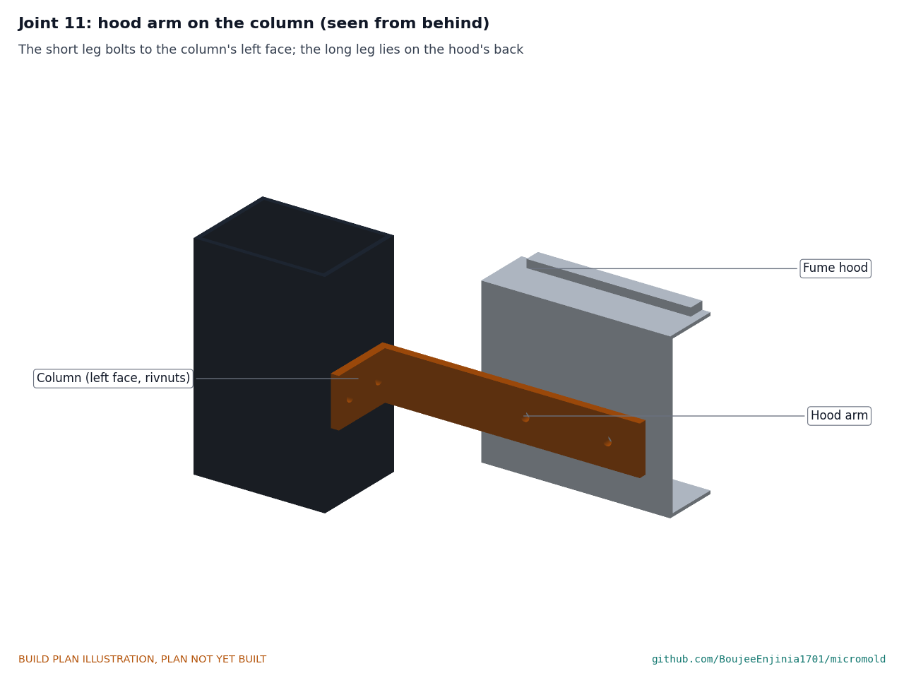

*Figure 25. The short leg bolts to the column's left face with two M6 screws into the rivnuts; the long leg lies on the hood's back, two M5 screws and nuts.*

The hood's open face is 100 from the funnel axis, its centre level with the barrel flange. The duct fan and 3 m of flexible duct take the air outdoors.

**Check before moving on.** The hood stays put when pushed by hand.

### 3.15 Test plaque mold

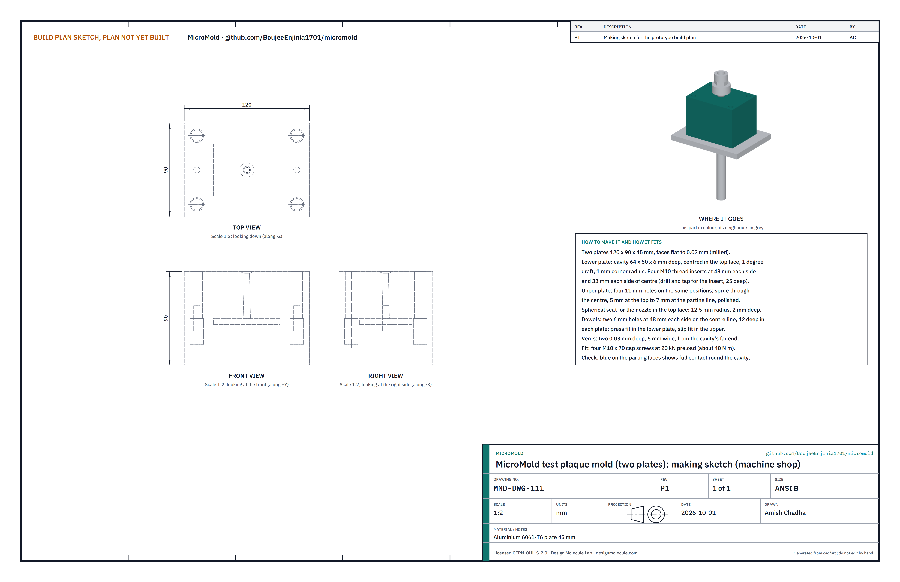

*Figure 26. Test plaque mold making sketch (MMD-DWG-111).*

**What it is and what it is made from.** Two aluminium plates that form a 64 x 50 x 6 mm test plaque, with the sprue through the upper plate. Aluminium 6061-T6, 45 mm plate, by a machine shop.

**How to make it.**

1. Mill two plates 120 x 90 x 45 mm, the parting faces flat to 0.02 mm.
2. Lower plate: mill the cavity 64 x 50 x 6 deep in the centre of its top face, with 1 degree of draft and 1 mm corner radii. Fit four M10 steel thread inserts, 25 deep, at 48 each side and 33 each side of centre.
3. Upper plate: drill four 11 mm holes at the same positions. Ream the sprue through its centre, 5 mm at the top to 7 mm at the parting face, and polish it. Cut the nozzle seat in the top face: a 12.5 mm spherical radius, 2 deep.
4. Dowels: two 6 mm holes on the centre line at 48 each side, 12 deep in each plate, press fit in the lower plate and slip fit in the upper. Fit the dowels in the lower plate.
5. Vents: two 0.03 mm deep, 5 mm wide, from the far end of the cavity.

**How it fits the parts next to it.**

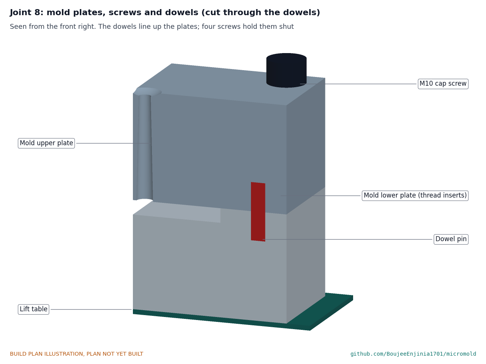

*Figure 27. The dowels line up the plates; four M10 x 70 cap screws hold them shut at about 40 N·m each (20 kN preload).*

The lower plate stands flat on the lift table; the nozzle seats in the upper plate's spherical seat (Figure 13). With the test mold (90 mm stack) seated, the table top is 102 above the bench.

**Check before moving on.** Engineer's blue on the parting faces shows full contact round the cavity.

### 3.16 Bought components

Buy to specification, not brand. Line numbers are those of the bill of materials.

- **Arbor press (line 2).** 1 t, rack and pinion, 28 mm square ram 255 mm or longer with 150 mm of engaged travel, pinion pitch radius about 20 mm, a head casting that can be cut from the frame with a flat back face. Prepared as section 3.5.
- **Ratchet handle (line 2).** 1/2 in drive, about 450 mm long, reversible.
- **Load cell (line 4).** 10 kN compression cell, 56 mm across, with a top M12 stud and a base flange with three through holes for M5 screws (46 mm circle assumed), an HX711-class amplifier and a 4-digit display.
- **Band heaters (lines 7 and 8).** Two 300 W mica bands, 42 mm bore x 50 wide, and one 100 W band, 24 mm bore x 18 wide, all for the local mains voltage, with ceramic terminal blocks.
- **Mica pads and washers (line 9).** Four 15 x 15 x 3 mm pads; four mica washers for M8.
- **Control box (line 13).** Earthed metal enclosure with a fused IEC inlet, a double-pole switch, two PID controllers with set point limits, two 25 A solid-state relays on a heat sink, a 280 °C independent thermal cut-out, a switched outlet for the duct fan and the mold fan, and the load cell display.
- **Wiring (line 14).** Wire rated 250 °C in glass-fibre sleeving for the heaters, two K-type thermocouples (one in the barrel well, one under the nozzle band), earth leads to the frame, the jacket, the shield and the fan bracket.
- **Duct fan and duct (line 17).** 100 mm inline fan, 170 m³/h or more in free air, 3 m of 100 mm aluminium flexible duct and clamps.
- **Mold cooling fan (line 18).** 120 x 120 x 38 mm mains axial fan, about 18 W, corner holes on a 105 mm square, with a finger guard.
- **Fixings (lines 9 to 19).** Four M10 x 25 countersunk screws (head); four M8 x 30 cap screws (flange); four M5 x 25 screws and 14 mm spacers (jacket); three M5 x 12 low-head screws and three M5 x 12 screws (spacer); four M10 x 70 class 8.8 cap screws, four M10 thread inserts and two 6 x 24 mm dowels (mold); a 6 mm ball-lock pin and a 6 mm roll pin; eight M6 x 12 screws (shield feet, fan bracket); two M6 rivnuts and two M6 x 16 screws (hood arm); two M5 screws and nuts (hood); four M4 x 45 screws and nuts (fan); four M10 bench bolts with washers; a 2 mm steel thrust washer for 20 mm; copper anti-seize and medium threadlocker.

## 4. Putting it together

In each picture the parts already fitted are grey and the part being fitted is in colour, with an arrow showing the way it goes in. Assemble on a workbench without the bench hole until step 13; keep the lift table at its highest until then, so the screw stays above the base plate. The barrel goes in from above, so it is fitted before the press head.

### Step 1: weld the column to the base plate

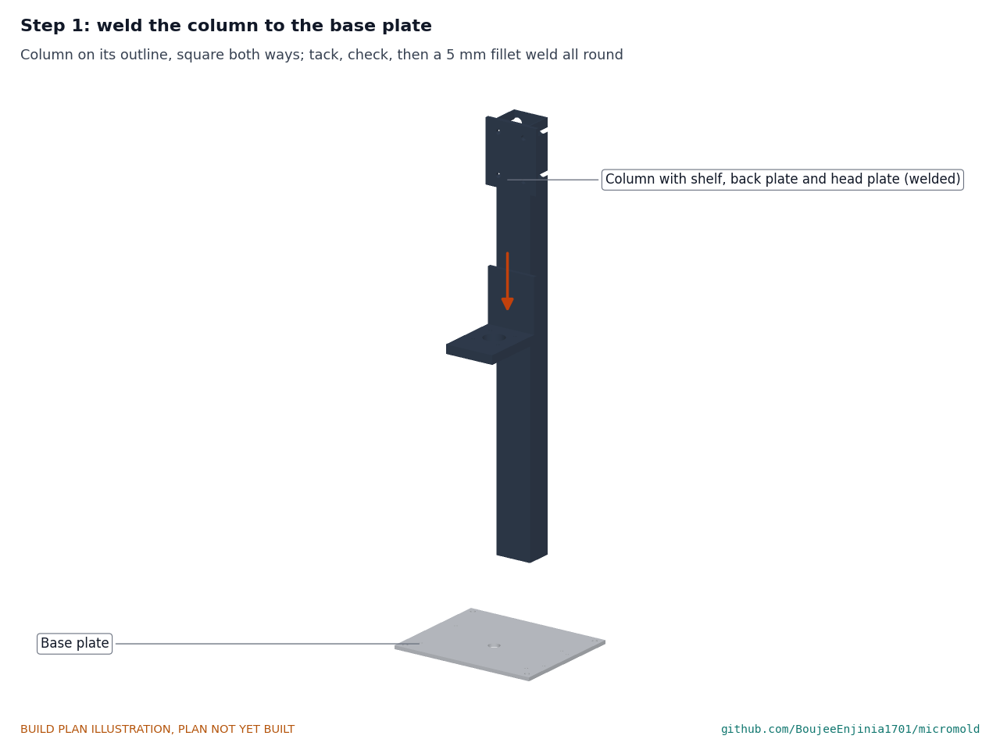

Stand the column weldment on its outline, square to the plate both ways. Tack weld, check square again, then weld a 5 mm fillet all round. **Hold point:** the column is square to the plate within 1 mm over its height.

### Step 2: lift table and handwheel nut

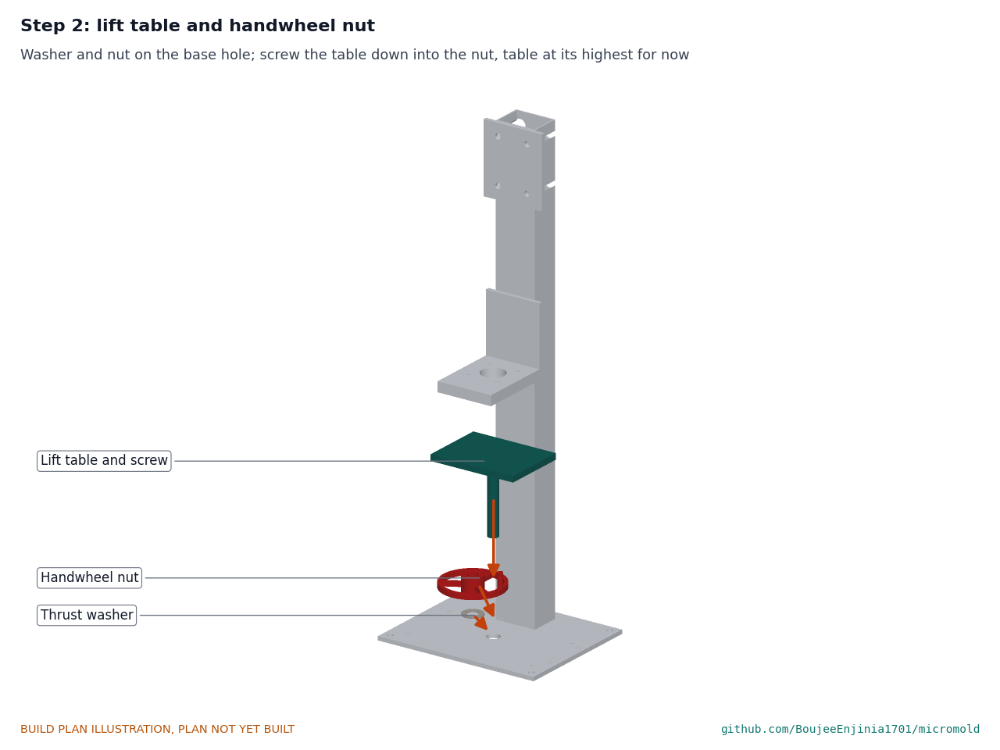

Lay the thrust washer over the lift screw hole and the handwheel nut on it. Screw the table's screw down into the nut by turning the handwheel, with the table's back edge toward the column, until the table is at its highest (160 above the bench).

### Step 3: nozzle onto the barrel

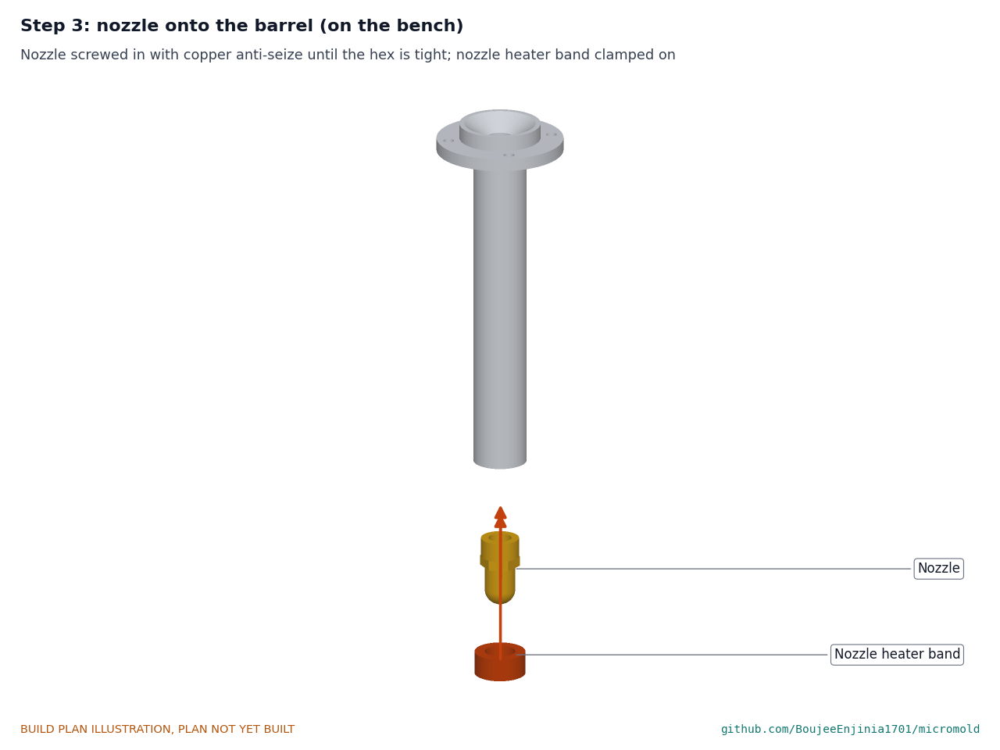

On the bench, screw the nozzle into the barrel with copper anti-seize until the hex is tight. Clamp the 100 W band round the nozzle body, terminals to the back.

### Step 4: barrel into the shelf

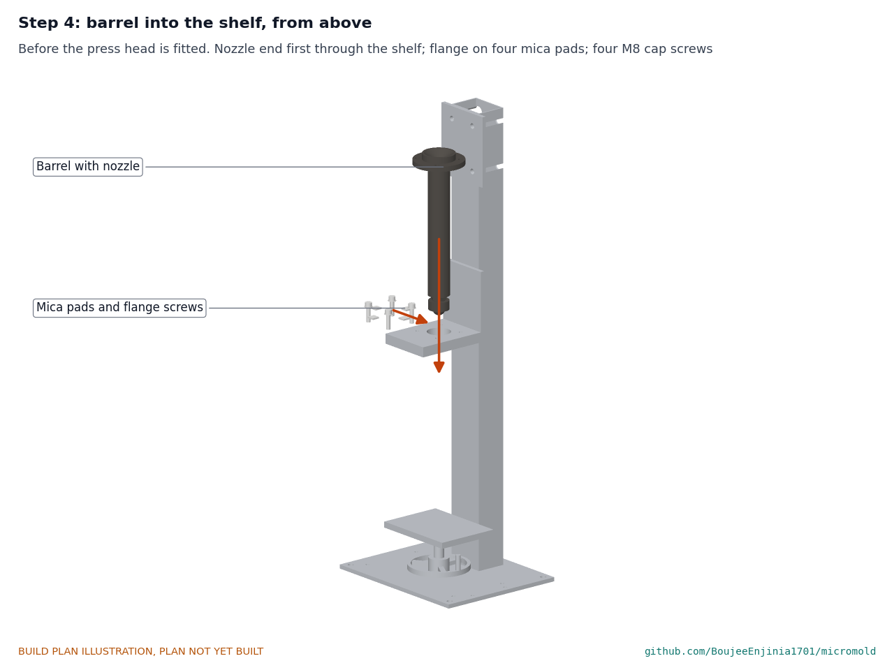

Lay the four mica pads on the shelf round the hole. Lower the barrel, nozzle first, through the hole from above until the flange sits on the pads; the nozzle and its band pass the 46 mm hole, the band heaters would not. Fit the four M8 cap screws with mica washers, snug (about 10 N·m); they only hold the barrel down.

### Step 5: band heaters and jacket

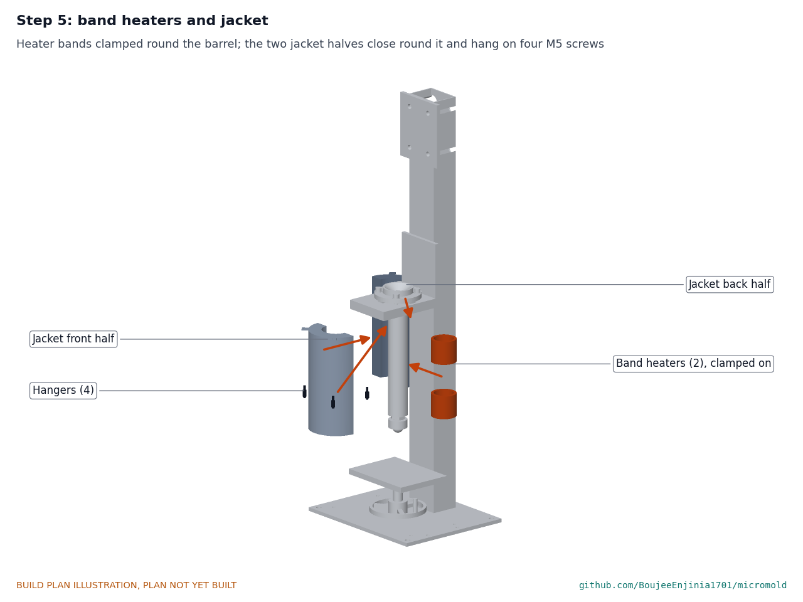

Clamp the two 300 W bands round the barrel, centred 60 and 180 above its lower end, terminals to the back. Close the two jacket halves round the barrel, back half (with the lead notches) behind, and hang each on two M5 screws through its tabs and spacers into the shelf.

### Step 6: press head onto the head plate

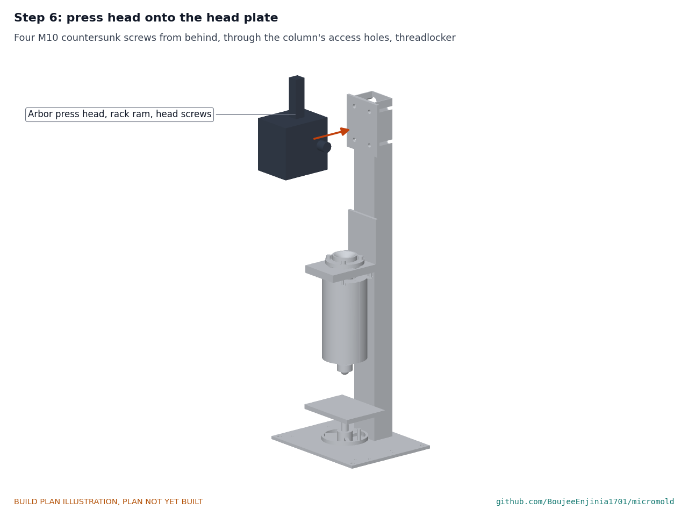

Hold the head against the head plate and fit four M10 countersunk screws from behind, through the column's access holes, with medium threadlocker. Tighten to about 45 N·m with a hex key through the holes.

### Step 7: ratchet adapter and handle

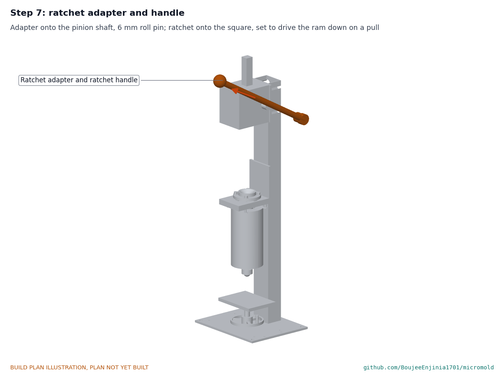

Slide the adapter onto the right-hand end of the pinion shaft and fit the roll pin. Push the ratchet onto the square and set it so a pull toward you drives the ram down. Turn the ram to its highest.

### Step 8: plunger unit

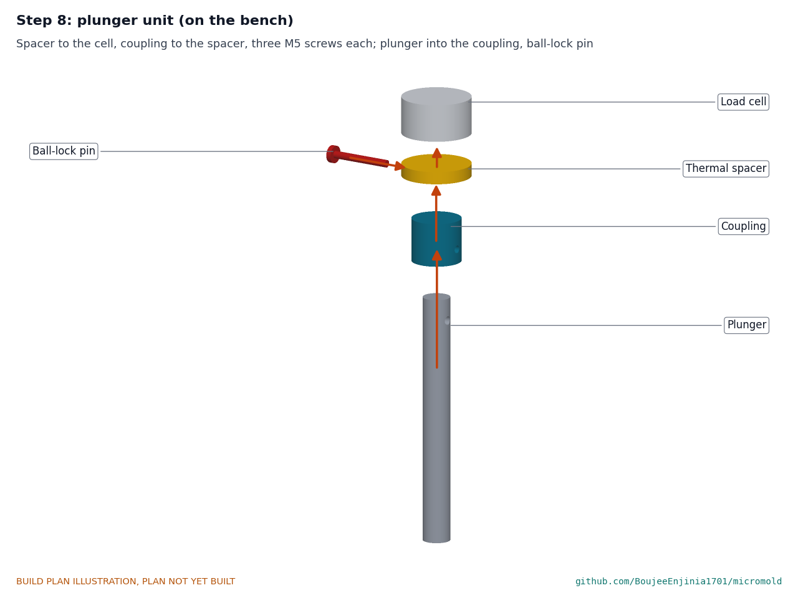

On the bench, screw the coupling under the spacer (three low-head screws) and the spacer under the load cell (three screws through the cell's flange). Push the plunger up into the coupling and fit the ball-lock pin.

### Step 9: plunger unit onto the ram

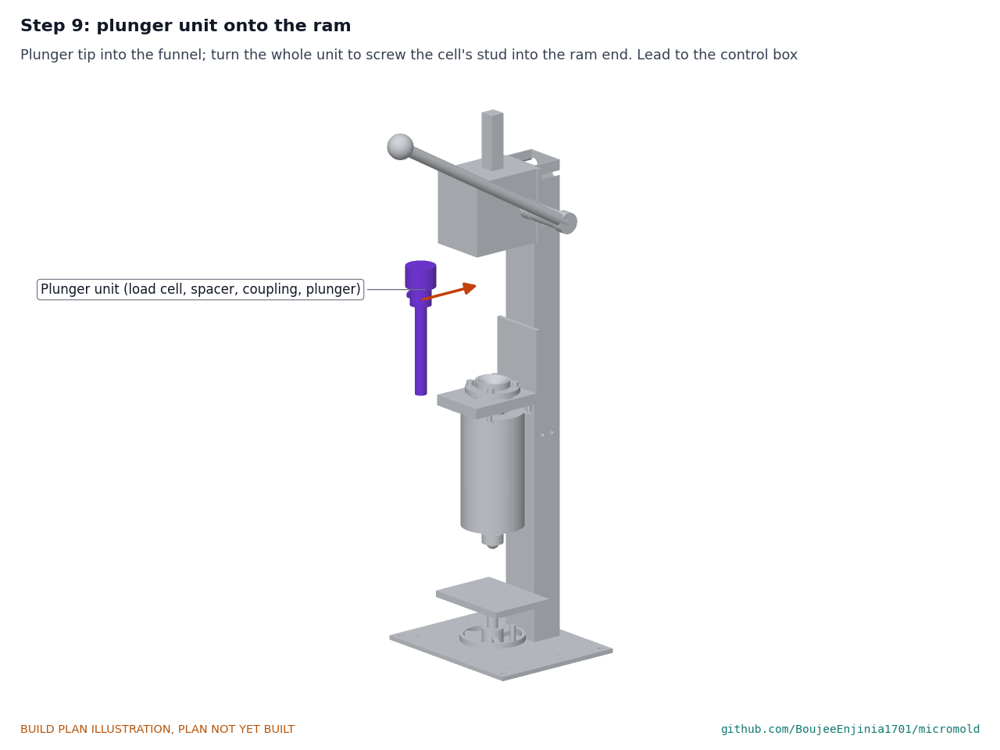

With the ram at its highest, set the plunger's tip into the funnel and turn the whole unit to screw the load cell's stud into the ram end. Run the load cell lead along the column to the control box. **Hold point:** the plunger runs the full 150 mm stroke by hand with no binding.

### Step 10: nozzle zone shield

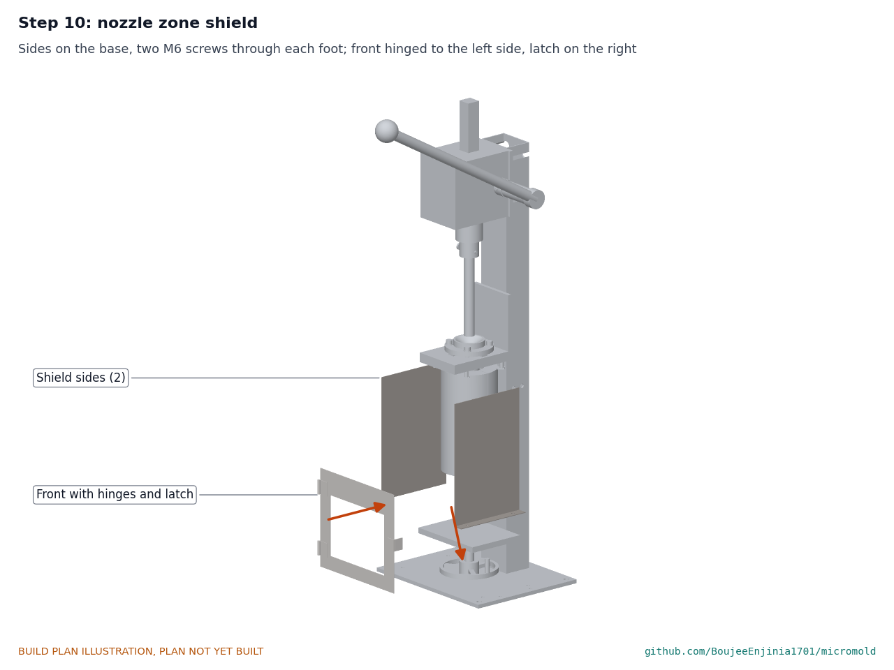

Stand the sides on the base plate and fit two M6 screws through each foot. Check that the front swings open and latches.

### Step 11: mold cooling fan

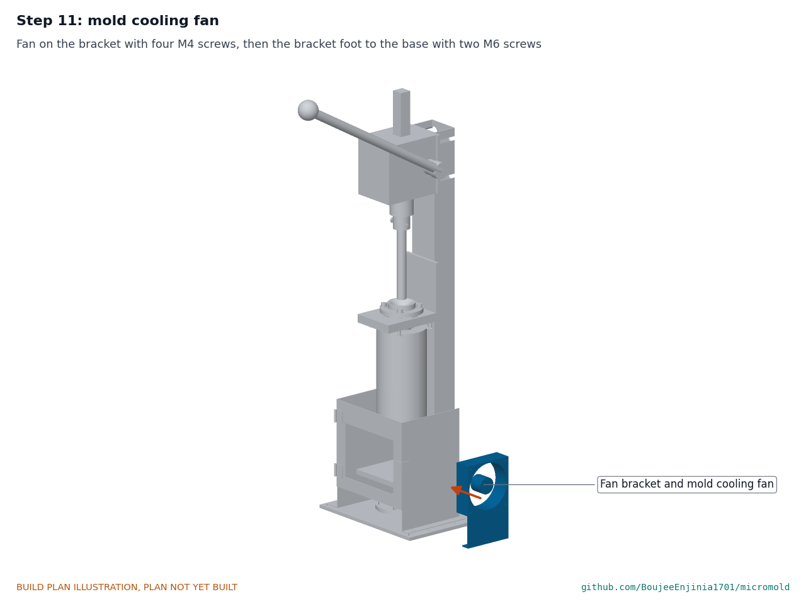

Fix the fan to the bracket with four M4 x 45 screws and nuts, then the bracket's foot to the base plate with two M6 screws.

### Step 12: fume hood

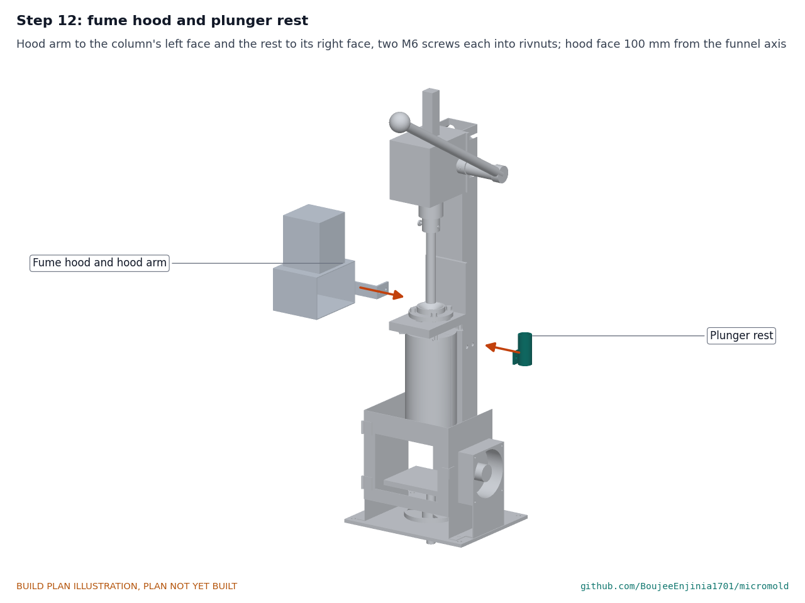

Bolt the arm's short leg to the column's left face with two M6 screws into the rivnuts. Fix the duct stub to the flexible duct and run it to the duct fan.

### Step 13: onto the bench, and wiring

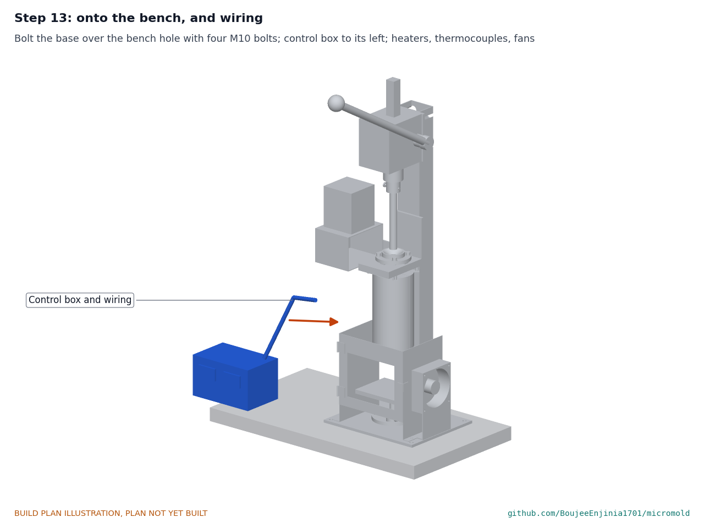

Drill a 25 mm hole through the bench top where the lift screw will go, with at least 60 mm clear below it. With two people, lift the press onto the bench with the screw over the hole and bolt the base plate down with four M10 bolts. Set the control box to the left. A qualified electrician wires the inlet, switch, RCD supply, controllers, relays, cut-out, heaters, thermocouples and fan outlet, and earths the frame, jacket, shield and fan bracket. **Hold point:** safety stop S1.

### Step 14: test mold onto the table

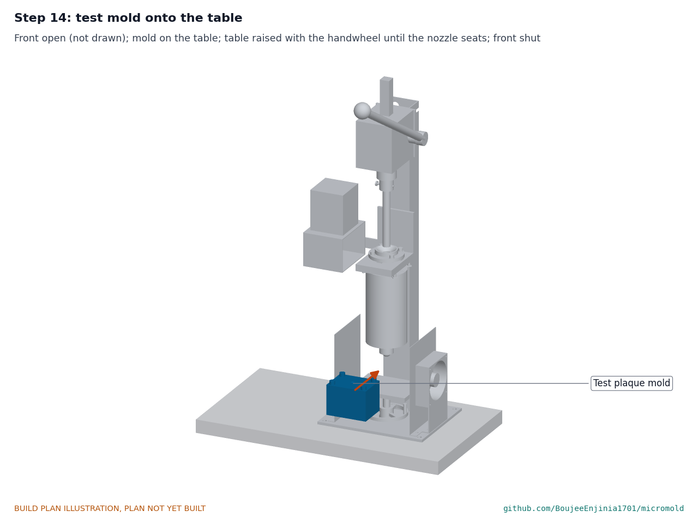

Open the shield front. Lower the table, stand the bolted mold on it centred under the nozzle, and raise the table with the handwheel until the nozzle seats in the mold. Shut the front. **Hold point:** safety stops S2 to S4 before any heating or injection.

## 5. First checks

These are the checks a TRL 4 test report would record; this plan only lists them. Requirement numbers are those of MMD-REQ-001.

*Table 2. First checks.*

| Check | Requirement | How | Pass when |
| --- | --- | --- | --- |
| Size, handle height and mass | R9 | Measure the footprint and the handle's top at the start of a pull; weigh the press without the control box | 350 x 300 mm or less; 1,100 mm or less (1,094 mm by the model); 40 kg or less (39.0 kg estimated) |
| Plunger travel | R2 | Turn the handle through a full stroke, cold | 150 mm of travel, 120 mm in the bore, no binding; about four pulls |
| Mold stack range | R7 | Seat a 30 mm and a 120 mm block on the nozzle with the handwheel | Both seat with at least 10 mm of travel to lower them |
| Electrical safety | R12 | Electrician's inspection: earth continuity, insulation, RCD trip | All pass; the RCD trips at 30 mA or less |
| Temperature control and cut-out | R4 | Heat both zones empty to 220 °C, then raise the cut-out's test set point | Each zone holds within 5 °C; the cut-out opens the heaters; set points above 260 °C are refused |
| Warm-up | R5 | Time from cold to 220 °C, barrel zone | 15 min or less (12.3 min estimated) |
| Touch temperature | R11 | Surface thermometer on the guard after 30 min at 220 °C | 60 °C or less (48 °C estimated) |
| Supply current | R10 | Clamp meter on the supply with everything running | 1 kW or less; 10 A or less at 120 V |
| Hood flow | R13 | Vane anemometer across the hood face | About 124 m³/h; smoke from a smoke pencil at the funnel goes into the hood |
| Melt pressure | R3 | Load cell reading with 250 N on the handle (a spring balance on the grip), barrel full of melt | 3.4 kN or more on the cell (8.9 MPa) |

## 6. Safety stops

Stop at each point. Carry on only when everything listed is true.

- **S1. Before the press is connected to the mains.** A qualified electrician has wired and inspected the control box to local code: fused inlet, double-pole switch, RCD or GFCI supply, independent cut-out in series with both heater relays, 250 °C wire at the barrel, every metal part earthed. Heater leads are clear of the plunger, ram and handle in every position.
- **S2. First heat, with no plastic.** Attended the whole time, hood running, shield shut, nothing flammable within 1 m. Both zones to 220 °C; stop and switch off at the inlet if any reading runs away, smoke appears or the guard passes 60 °C.
- **S3. Before any plastic goes in.** The resin is HDPE, PP, LDPE or PS flake from injection-molded items, clean and dry; never PVC or unknown plastics. Heat-resistant gloves, long sleeves and eye protection are on. The hood fan runs whenever the heaters are on.
- **S4. Before every injection.** Mold screws at their torque, the nozzle seated, the shield front shut and latched, faces away from the axis. Pull steadily with no more than about 250 N; never hang body weight on the handle (about 35 MPa, enough to open the mold). Release the ratchet pawl only with the handle in hand.
- **S5. Before opening the mold.** The fan has run for at least 1 min after the hold; lower the table before opening the front; gloves on. The sprue and plaque are hot.
- **S6. Before leaving the press.** Heaters off at the inlet; the barrel left to cool with the hood running.

## 7. Tools, skills and workspace

**Tools.** Angle grinder with cutting and grinding discs; hacksaw or bandsaw; bench drill with a vice; drills 3 to 22 mm and a 25 mm hole saw or step drill; 112 mm hole saw; countersink; taps M5, M6, M8, M10 and M12 with tap drills; rivnut tool; pop rivet tool; aviation snips; sheet folder or two lengths of steel angle clamped in a vice; MIG or stick welder for steel up to 20 mm; engineer's square, steel rule, calipers, scriber, centre punch; files and deburring tool; spanners, hex keys (including a long 6 mm key for the head screws) and a torque wrench to about 50 N·m; multimeter and clamp meter; surface thermometer; vane anemometer; spring balance to 300 N; scales to 50 kg. A machine shop makes the barrel, nozzle and mold.

**Skills.** Marking out, sawing, drilling, tapping and folding sheet; fillet welding of steel plate and tube; fitting bought parts to drawings. Mains wiring is not part of a maker's work here: it must be done or checked by a qualified electrician.

**Workspace.** A sturdy bench about 1.2 x 0.6 m that may be drilled, at about 0.9 m high, with a mains socket on an RCD and an outside wall or window for the duct; a separate fire-safe area for welding and grinding.

**Personal protective equipment.** Welding helmet, leather gloves and jacket for welding; safety glasses and hearing protection for grinding and drilling; heat-resistant gloves, long sleeves and eye protection whenever the press is hot; no loose gloves near a turning drill.

## 8. Where the numbers come from

- Model and constructability checks: `cad/src/model.py` (`python cad/src/model.py --check`, 155 checks); STEP and STL exports in `cad/step/` and `cad/stl/`.
- Pictures: `cad/src/build_plan_media.py`, using `.kit/build_views.py`; written to `docs/05-build-plan/` and `cad/drawings/MMD-DWG-101` to `MMD-DWG-114`.
- General arrangement: `cad/drawings/MMD-DWG-001.pdf`, Rev P4.
- Calculations: `docs/04-calcs/01-sizing.md` (MMD-CAL-001 v0.4) and `docs/04-calcs/sizing.py`; shot [A2], table and stacks [A5], stroke and pulls [B5], mold screws [D1], warm-up [G4], plunger temperature [G6], mass [K1], heights [K2], cost [L1, L2].
- Bill of materials: `bom/bom.csv`.
- Decisions: `docs/decisions/0003-design-for-construction.md` (MMD-DDR-003), with MMD-DDR-001 and MMD-DDR-002; open items in `docs/06-design-decisions.md` (MMD-DEC-001).
- Requirements: `docs/03-requirements.md` (MMD-REQ-001 v0.6).
